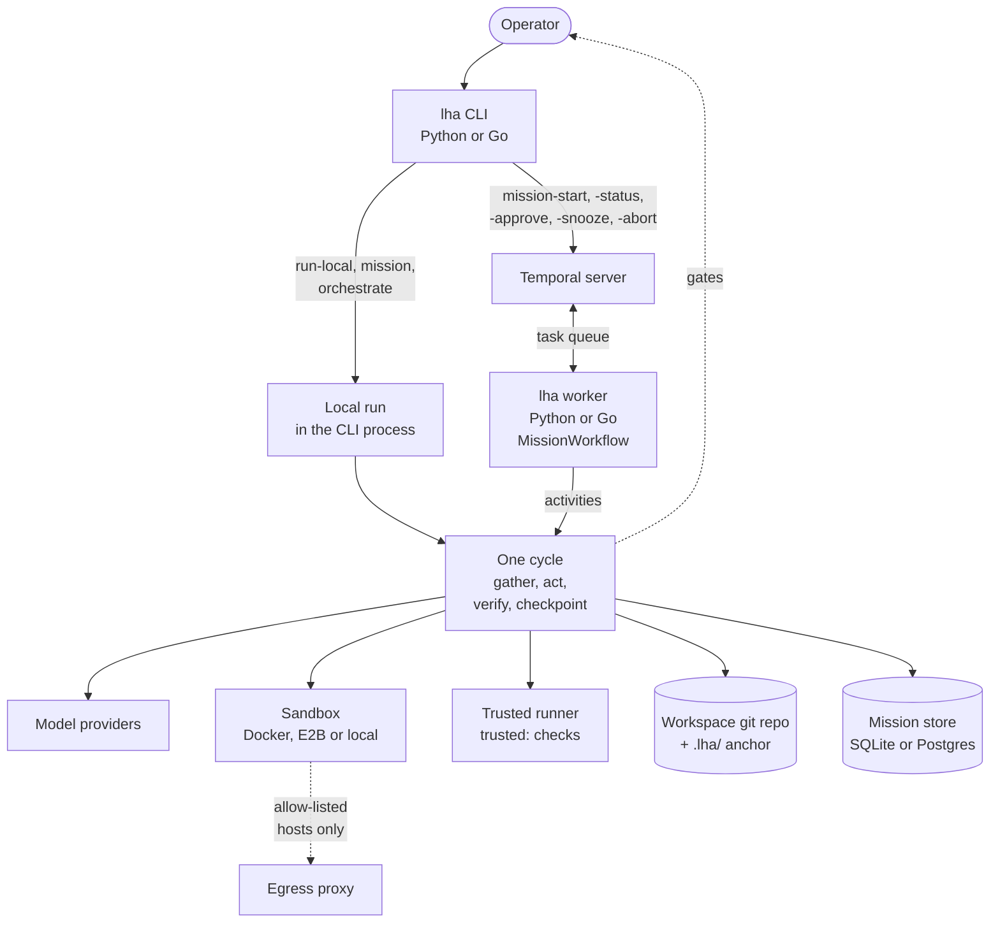
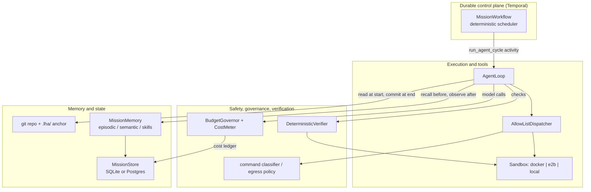
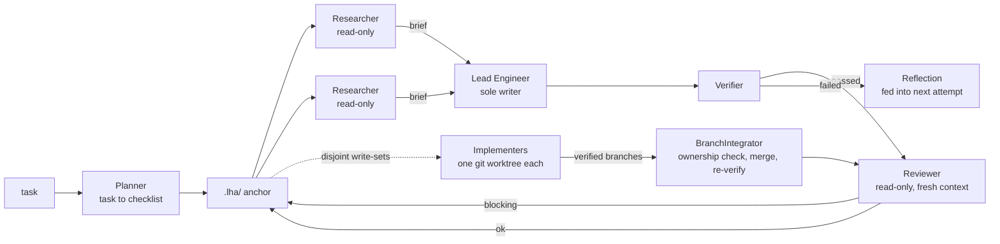
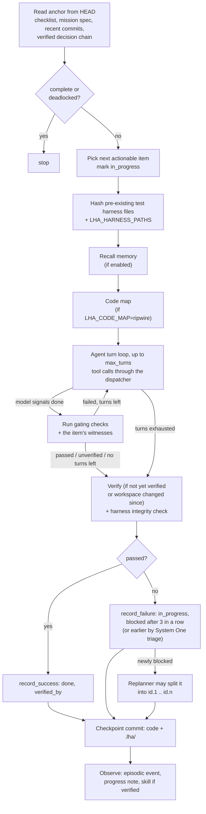

# Architecture

LHA separates what has to persist for weeks (the mission's state and schedule) from what the
model does in a single burst (one checklist item). The model never holds the only copy of
anything: the git repository and the `.lha/` anchor hold the mission state, Temporal holds the
schedule, and the verifier decides what is done.

Code paths below refer to the Python implementation, which is the reference. The Go port mirrors
the same package layout (see [choosing an implementation](04-choosing-an-implementation.md)).

## System context

How the pieces are deployed and what talks to what. A mission runs either in the CLI process (a
local run) or on a Temporal worker (a durable run); both run the same cycle against the same
services. Either implementation can be the CLI or the worker, but a task queue is served by one
implementation at a time (see [choosing an implementation](04-choosing-an-implementation.md)).

The other connections, each used only when it is configured:

| From | To | When |
|---|---|---|
| a cycle | the internet, through `fetch_url` and `web_search` | `LHA_WEB_ALLOW_HOSTS` is set |
| the sandbox | the internet, through the egress proxy | `LHA_SANDBOX_EGRESS*` lists hosts |
| a cycle | a System One model (Jev or Kev) | `LHA_SYSTEM_ONE_BACKEND` is set ([25-system-one.md](25-system-one.md)) |
| a durable mission's gates | a webhook | `LHA_GATE_WEBHOOK_URL` is set |
| the worker | the object store (payloads over 32 KiB) | always, for large payloads ([ClaimCheck](08-durable-execution.md#claimcheck-payload-codec)) |
| the CLI and the worker | an OTLP collector or Langfuse | an OTLP endpoint or the Langfuse keys are set |
| `lha vendor` | the named pages on the internet | when run |
| `lha db migrate`, `missions`, `costs`, `gates`, `memory reembed`, `objects prune` | the mission store and the object store | when run |
| `lha decisions --verify` | the workspace's decision log | when run |

A model provider is Ollama, an OpenAI-compatible endpoint, Claude, Claude Code (`claude -p`),
OpenCode (`opencode run`) or the stub, then each entry of `LHA_FALLBACK_MODELS` in turn. The worker's activities are
`run_agent_cycle`, `check_mission_health`, `notify_gate`, `declare_impossible`, `unblock_items`,
`read_mission_snapshot` and `record_mission_status`, plus `plan_round`, `run_implementer`,
`integrate_branch` and `review_cycle` for the opt-in organization; `--research N` adds
`SubAgentWorkflow` children ([durable execution](08-durable-execution.md)).

The Temporal server is the only component that must be running for durable missions; a local
run needs nothing but git, a sandbox and a model. The mission store defaults to a SQLite file
(`LHA_SQLITE_PATH`; unset, one per-user file such as `~/.local/share/lha/lha.sqlite3` that every
process shares; moved under `.git/lha/` if it would land inside the mission checkout); with `LHA_POSTGRES_DSN` set it is Postgres, and if Postgres cannot be
opened the run falls back to SQLite unless `LHA_POSTGRES_FALLBACK_TO_SQLITE=false`. The
workspace git repository is the mission's source of truth in both modes, so a mission
initialized by one can be inspected with plain `git`.

With the `observability` extra installed and an OTLP endpoint
(`LHA_OTEL_EXPORTER_OTLP_ENDPOINT` or `OTEL_EXPORTER_OTLP_ENDPOINT`) or the Langfuse keys set, the
CLI and the worker install an OTLP/HTTP trace exporter at start
([`obs/otel.py`](../python/src/lha/obs/otel.py)); missions, cycles, cycle activities, parallel
implementers, model calls and tool calls become spans. Export runs in the background and never
blocks a run. See [observability](16-observability.md).

## Four planes

| Plane | Responsibility | Code |
|---|---|---|
| Durable control plane | Schedule cycles, survive crashes, park on outages, sleep on schedule, bound history, wait for humans | [`durable/`](../python/src/lha/durable/) |
| Memory and state | The mission anchor in git, re-read every cycle; the mission store (mission rows, cost ledger); tiered memory; file ownership and the decision chain | [`state/`](../python/src/lha/state/), [`contracts/state.py`](../python/src/lha/contracts/state.py), [`persistence/`](../python/src/lha/persistence/), [`memory/`](../python/src/lha/memory/), [`coordination/`](../python/src/lha/coordination/) |
| Execution and tools | Sandboxes, the tool dispatcher, file and shell tools | [`execution/`](../python/src/lha/execution/) |
| Safety, governance, verification | Command gating, egress policy, budget, loop detection, the verifier | [`safety/`](../python/src/lha/safety/), [`governor/`](../python/src/lha/governor/), [`verify/`](../python/src/lha/verify/), [`hitl/`](../python/src/lha/hitl/) |

### Durable control plane

`MissionWorkflow` ([`durable/workflows.py`](../python/src/lha/durable/workflows.py)) makes no
model, tool or file calls, and reads time only through `workflow.now()`. It loops: run one
`run_agent_cycle` activity, record the result, and stop when the checklist is complete, a
deadlock is not resolved (outcome `deadlocked`, `aborted` or `impossible`), the budget is
exhausted or `max_cycles` is reached.

- **Unit of journaling.** One activity is one whole cycle. Temporal records its result, so a
  completed cycle is not re-run on replay. An attempt that crashes mid-cycle is retried from
  scratch, and its model calls are made again.
- **Retry safety.** Each attempt takes a per-workdir file lock, resets the checkout to `HEAD`,
  and checks whether `HEAD` already carries this cycle id's checkpoint (committed by an attempt
  that crashed before reporting); if so it returns that result instead of advancing again. Spend
  from every attempt is journaled under `.git/lha/` so the budget covers retried attempts.
  Activities heartbeat so a dead worker is detected within the 2-minute heartbeat timeout.
- **Parking.** When a cycle exhausts its retries on a transient error, the workflow enters
  `DEGRADED_PARK`: a durable sleep with exponential backoff (default 60 s, capped at 3600 s)
  between `check_mission_health` probes of git, the model and the sandbox. The model probe
  ([`model/health.py`](../python/src/lha/model/health.py)) contacts the provider with a cheap
  request, and a `FailoverModel` counts as healthy if any member is. Budget and configuration
  errors are non-retryable and end the mission, and so does a committed decision log whose hash
  chain no longer verifies.
- **Sleeping.** The status is `SLEEPING` while the workflow waits on a durable timer by design:
  a scheduled start (`lha mission-start --start-in-seconds`), the pause between cycles
  (`--cycle-pause-seconds`, `LHA_CYCLE_PAUSE_SECONDS`) or `lha mission-snooze` (the `snooze_v1`
  signal; `0` wakes the mission).
- **Bounded history.** Continue-As-New every 200 cycles (`cycles_before_can`) or when Temporal
  suggests it; carried state rides in `MissionInput.state`.
- **Worker builds.** With `LHA_WORKER_DEPLOYMENT` and `LHA_WORKER_BUILD_ID` set, the worker polls
  as one build of a Temporal Worker Deployment, and by default a mission stays on the build that
  started it, so a deploy does not replay it on changed workflow code (`LHA_WORKER_PROMOTE` makes
  the new build current). See
  [versioned deploys](14-running-on-temporal.md#versioned-deploys-worker-build-ids).
- **Humans.** A `human_decision_v1` signal resolves a gate, `steer_v1` appends an operator
  note to every following cycle's prompt, the `status_v1` query distinguishes `RUNNING`,
  `SLEEPING`, `DEGRADED_PARK` and `WAITING_ON_HUMAN`, and the `gate_v1` and `gate_log_v1`
  queries return the open gate and its history. The workflow opens two kinds of gate: an
  approve/reject gate for each irreversible action a cycle attempted
  (`approval_timeout_seconds`, default 24 h, then rejected), and a retry/abort/impossible gate
  on deadlock (`deadlock_gate_seconds`; `lha mission-start` sets 24 h by default, then applies
  `LHA_DEADLOCK_GATE_DEFAULT`, `abort` unless set to `impossible`). While a gate is open,
  reminders follow the escalation ladder (`LHA_GATE_ESCALATION_SECONDS`); each is recorded in
  the anchor and, when `LHA_GATE_WEBHOOK_URL` is set, posted to the webhook by the `notify_gate`
  activity. See [durable execution](08-durable-execution.md#human-gates).

The workflow itself never touches a database. The cycle activity writes the mission row:
`RUNNING` (also for a deadlocked checklist, whose outcome the workflow decides), `DONE`,
`WAITING_ON_HUMAN` (the cycle queued an approval) and `ABORTED` (budget). The workflow writes the
statuses only it decides through the best-effort `record_mission_status` activity:
`DEGRADED_PARK`, `SLEEPING`, an open gate's `WAITING_ON_HUMAN`, and the final status of every
ending (`DONE`; `IMPOSSIBLE` for a deadlock or an "impossible" decision; `ABORTED` for an abort
at a gate, `max_cycles`, the budget, a non-retryable failure or a cancellation). The store never moves a row from `DONE`, `IMPOSSIBLE` or `ABORTED` back to a
non-terminal status, and a cancelled cycle is waited for before `ABORTED` is written, so an abort
during a cycle ends as `ABORTED`. `lha mission-status` reads the live status from the workflow.
Every gate event (opened, reminder, resolved, defaulted) is written to the `hitl_gates` table by
the `notify_gate` activity (`lha gates`).

### Memory and state

The mission anchor is described in [the mission anchor](06-mission-anchor.md). Besides the
checklist and logs it holds `.lha/decisions.ndjson`, a SHA-256 hash-chained decision log the lead
appends to with the `record_decision` tool (`lha decisions --verify` checks it), and, when the
Planner assigned write-sets, `.lha/ownership.json`.

Every run path (the local runners, `lha orchestrate` and the `run_agent_cycle` activity) opens
the same services through `open_run_services`
([`persistence/services.py`](../python/src/lha/persistence/services.py)):

- the `MissionStore` ([`persistence/store.py`](../python/src/lha/persistence/store.py)), SQLite
  or Postgres, holding one row per mission, a `cost_ledger` row for every metered model call and
  a `hitl_gates` row for every human gate (`lha missions`, `lha costs`, `lha gates`). Store
  errors are logged, never raised into the cycle.
- `MissionMemory` ([`memory/service.py`](../python/src/lha/memory/service.py)), when
  `LHA_MEMORY_ENABLED` is true (the default): before the lead's first turn it recalls a bounded
  block of episodic, procedural (skills) and semantic memory into the prompt; after the
  checkpoint it records the outcome and periodically consolidates. Semantic retrieval fuses BM25
  and an embedder's cosine ranking. The default embedder (`LHA_MEMORY_EMBEDDER=hash`) is a
  deterministic lexical hash, not a semantic model; `ollama` (a local Ollama, no extra, $0),
  `voyage` (the paid Voyage AI API, `LHA_VOYAGE_API_KEY`) and `sentence_transformers` are
  semantic. When Postgres, pgvector or the embedder is unavailable, the
  dense channel is dropped and retrieval runs on BM25 and `git grep`; memory errors never fail a
  cycle.

See [memory](12-memory.md).

### Execution and tools

- **Assembly** ([`agent/assembly.py`](../python/src/lha/agent/assembly.py)): the local
  runner, the durable cycle activity and `lha orchestrate` build the lead the same way from
  settings: sandbox image and egress allow-list, tools, human gate, a verifier that sends
  `trusted:` checks to the trusted runner and re-runs failing checks to quarantine proven
  flakes, protected harness paths and the replanner. With `LHA_MUTATION_CHECK` set, a green
  verdict must also pass the opt-in mutation gate
  ([mutation gate](07-verification.md#mutation-gate)).
- **Sandboxes** ([`execution/factory.py`](../python/src/lha/execution/factory.py)): `docker`
  (default; image `LHA_SANDBOX_IMAGE`, no network unless the `LHA_SANDBOX_EGRESS*` settings list hosts,
  dropped capabilities, read-only root and read-only `.git/` and `.lha/` mounts), `e2b`, and
  `local` (no isolation; refused unless `LHA_ALLOW_UNSAFE_LOCAL=true` or `--unsafe-local`).
- **Dispatcher** ([`execution/dispatcher.py`](../python/src/lha/execution/dispatcher.py)): a
  fail-closed allow-list of tool names, default-deny for mutating and egress tools, JSON-schema
  argument checks, workspace path containment, no writes to `.lha/` or `.git/`, and routing of
  commands classified as irreversible to a human gate ([`hitl/approvals.py`](../python/src/lha/hitl/approvals.py)):
  the durable path queues them for `lha mission-approve`, local runs ask on the terminal with
  `--approve-interactive`, and with no gate they are denied. It also enforces the "rule of two".
- **Tools** ([`execution/tools/`](../python/src/lha/execution/tools/)): the default set is
  `read_file`, `write_file`, `edit_file`, `list_files`, `grep` and `run_command`, and the lead
  also gets `record_decision`; with `LHA_CODE_QUERY=true` every role also gets the read-only
  `code_query` ([09](09-safety-model.md)). When `LHA_WEB_ALLOW_HOSTS` (plus any `--allow-host`) is non-empty,
  `fetch_url` is added, limited by an egress policy to those hosts, with public-address checks,
  per-redirect re-checks and credentials from `LHA_WEB_CREDENTIALS` injected only for the hosts
  they are bound to; `web_search` is added when a search provider and key are also configured
  ([`execution/tools/toolset.py`](../python/src/lha/execution/tools/toolset.py)). Their output is
  fenced as untrusted content. A run with web tools is refused before it starts with a `local`
  sandbox or `LHA_PRIVATE_DATA=true` (Rule of Two). The web tools resolve each host once, check
  every address, and connect to a checked address while TLS and the `Host` header keep the
  hostname, so DNS rebinding cannot redirect the connection.

See [the safety model](09-safety-model.md).

### Safety, governance and verification

- The [verifier](07-verification.md) is the only way an item becomes `done`.
- `BudgetGovernor` authorizes each cycle (projected from the most expensive cycle so far) and
  each model call (spent + reserved + this call's worst case must fit under the ceiling).
  Unpriced models are refused unless `LHA_ALLOW_UNPRICED_MODELS=true`. See
  [cost and budget](10-cost-and-budget.md).
- `LoopDetector` stops a local run after `LHA_STALL_LIMIT` (default 5) consecutive failures with
  the same signature.

## The asymmetric organization

Multiple agents help with reading a codebase in parallel and with independent review; they hurt
when several agents edit coupled code. The organization is shaped accordingly: one writer by
default, and parallel writers only for items whose Planner-assigned write-sets do not overlap.

In this diagram the dashed edge marks the path taken only when items have disjoint
Planner-assigned write-sets (in `lha orchestrate`, or a durable mission started with
`--max-parallel`). A durable mission runs the researchers, the reviewer and the waves only if it
opts in.

What runs where today:

| Role | `lha mission` / `lha run-local` | durable (`lha mission-start`) | `lha orchestrate` |
|---|---|---|---|
| Planner | Yes (not in `run-local`, or when `--checklist` is given) | Yes (not with `--checklist`) | Yes (not with `--checklist` or `--resume`) |
| Lead Engineer (the `AgentLoop`) | Yes | Yes | Yes |
| Replanner (splits a blocked item) | Yes, unless `LHA_MAX_REPLANS=0` | Yes | Yes |
| Researchers | No | With `--research N`: N per item before each round, as child workflows | 2 per item, concurrently, with read-only tools |
| Reflection after a failed cycle | No | No | Yes |
| Reviewer (can reopen a verified item) | No | With `--review` | Yes |
| Parallel implementer waves, each in its own git worktree, merged by the `BranchIntegrator` | No | With `--max-parallel N` (N of 2 to 8): one activity per implementer and per integration | Yes, when two or more actionable items have disjoint write-sets (`LHA_MAX_PARALLEL_IMPLEMENTERS`, default 3; below 2 disables waves) |
| Write enforcement from `.lha/ownership.json` (`OwnershipGuard`), lease granting | No | When planned with `--max-parallel`: the lead and each implementer | Yes, for the lead and each implementer |
| Tickets | No | In waves | Yes |
| Blackboard | No | No | Yes |
| `record_decision` and the chained decision log | Yes | Yes | Yes |

`lha orchestrate --resume` continues the mission in an existing workspace; without it,
`orchestrate` refuses a workspace that already holds one. An implementer that needs a file
outside its write-set asks for a lease (`request_lease`), which is granted when the file is
unowned (and not a shared or harness file) or its owner has finished. The `BranchIntegrator` is deterministic code, not a model
role, and the `librarian` label in the cost ledger is the memory consolidation model. See
[the multi-agent organization](11-multi-agent-organization.md).

## The model layer

One `ModelProvider` interface ([`contracts/model.py`](../python/src/lha/contracts/model.py));
`build_provider` in [`model/__init__.py`](../python/src/lha/model/__init__.py) picks the backend
from `LHA_MODEL_BACKEND`:

| Backend | Implementation | Cost |
|---|---|---|
| `stub` (default) | `StubModel`, deterministic, model name `stub:*` | $0; tests and CI only |
| `ollama` | `OpenAICompatModel` against `LHA_OLLAMA_BASE_URL/v1` | Priced at $0 |
| `openai_compat` | `OpenAICompatModel` against `LHA_OPENAI_BASE_URL` | Unknown unless `LHA_OPENAI_PRICE_*_PER_MTOK` are set |
| `claude` | `ClaudeModel`, Messages API over HTTP | Built-in price table, overridable |
| `claude_code` | `ClaudeCodeModel` (Go: `model.ClaudeCodeModel`), the `claude -p` CLI | The `total_cost_usd` Claude Code reports |
| `opencode` | `OpenCodeModel` (Go: `model.OpenCodeModel`), the `opencode run` CLI | The session cost from `opencode session export` (falling back to the streamed per-step cost) |

Cost is computed from the token usage in each provider response. Under the `claude` backend,
`lha orchestrate` routes roles to model tiers (planner, lead and reviewer to Opus, implementers
to Sonnet, researchers to Haiku), and so do the durable organization's implementers and reviewer. With `LHA_FALLBACK_MODELS` set (`backend:model[@in/out]`
entries), `build_provider` returns a `FailoverModel`
([`model/failover.py`](../python/src/lha/model/failover.py)) that tries the primary, then each
fallback in order; each turn is priced by the provider that served it. Every member is built
from the same settings, so all `openai_compat` members share `LHA_OPENAI_BASE_URL` (and all
`ollama` members `LHA_OLLAMA_BASE_URL`). See [models](13-models.md).

## The cycle

Every cycle, whether run locally or inside the `run_agent_cycle` activity, follows the same
steps in [`agent/loop.py`](../python/src/lha/agent/loop.py):

1. **Read the anchor.** The checklist, mission spec and recent history are read from the
   committed `HEAD`, not from the working tree or the model. The decision log's hash chain is
   verified on every read; if it does not verify, the local runners stop and the durable
   activity fails the mission with a non-retryable error.
2. **Pick an item.** An `in_progress` item first, otherwise the first `todo` item whose
   dependencies are all `done`.
3. **Agent loop.** The prompt recites the immutable mission spec (including its list of vendored
   references), then gives the item, its witnesses (each with the command that runs it, when it
   runs in the sandbox), its last verification failure, the last 10 commits, the recalled memory
   block (when memory is enabled), the cycle-start code map (when `LHA_CODE_MAP=ripwire`; see
   [a code map each cycle](24-large-missions.md#optional-a-code-map-each-cycle)) and the tool
   list. The model replies with one JSON
   action (or native tool calls). Invalid or truncated replies get a corrective turn and never
   count as done.
4. **Verify.** When the model signals done, the mission checks and the item's witnesses run
   (`trusted:` witnesses on the trusted runner, outside the sandbox). A failing check is re-run
   once (`LHA_FLAKY_RETRIES`); one that then passes is quarantined and stops counting as a gate
   ([flaky-check quarantine](07-verification.md#flaky-check-quarantine)). A failure is fed back
   and the loop continues while turns remain. The final verdict includes a failing
   `harness_integrity` check if pre-existing tests, test config or operator-protected paths were
   changed.
5. **Replan.** If the failure just blocked the item and the replan budget allows, the replanner
   asks the model to split it into 2 to 6 child items; the parent becomes `split`.
6. **Checkpoint.** One git commit containing the rewritten anchor (including any decisions
   recorded with `record_decision`) and, when the item passed, the code changes, with the message
   `lha: complete|attempt|block|split <id> (<description>)`. When verification failed, the
   attempt's changes are saved under `refs/lha/attempts/<mission>/<cycle>` and discarded, so that
   checkpoint holds only the anchor.
7. **Observe.** With memory enabled, the outcome is recorded as an episodic event and a progress
   note, a verified item's approach is admitted as a skill, and consolidation runs every
   `LHA_MEMORY_CONSOLIDATE_EVERY` outcomes.

Local runners repeat cycles until the checklist is complete, deadlocked, over budget, a loop is
detected, the decision log fails verification, the model stays unavailable after its retries and
fallbacks (`model unavailable: <error> after <n> attempts`; see
[models](13-models.md#retries-and-failover)) or `max_cycles` is reached; the durable workflow does
the same across activities, but parks on an unavailable model instead of stopping.
