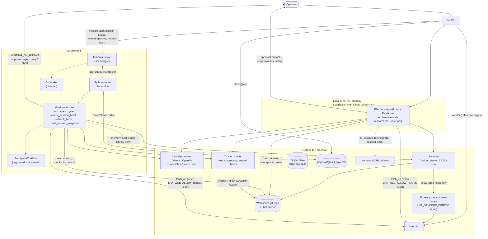
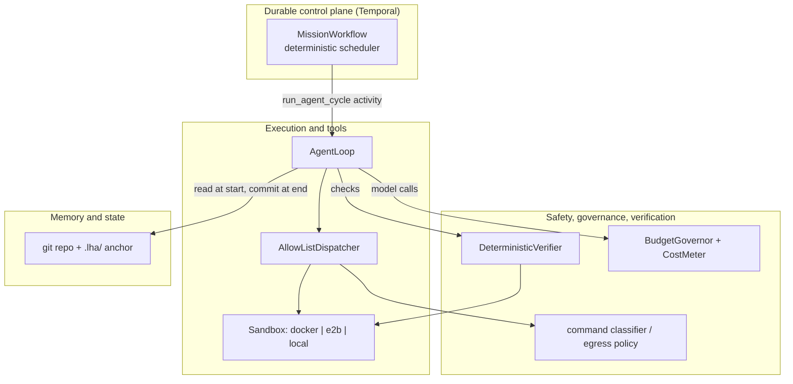
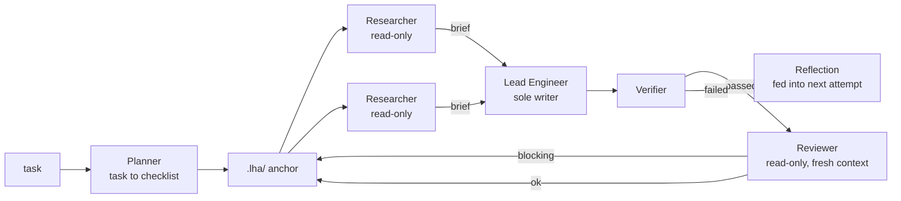
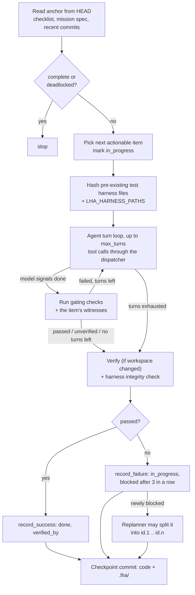

# Architecture

LHA separates what has to persist for weeks (the mission's state and schedule) from what the
model does in a single burst (one checklist item). The model never holds the only copy of
anything: the git repository and the `.lha/` anchor hold the mission state, Temporal holds the
schedule, and the verifier decides what is done.

Code paths below refer to the Python implementation, which is the reference. The Go port mirrors
the same package layout (see [choosing an implementation](04-choosing-an-implementation.md)).

## System context

How the pieces are deployed and what talks to what. Solid lines are wired into a run path today;
dashed lines and dashed boxes are implemented as library code but not yet called by any command,
or planned.

The Temporal server is the only component that must be running for durable missions; a local
run needs nothing but git, a sandbox and a model. The workspace git repository is the mission's
source of truth in both modes, so a mission initialized by one can be inspected with plain `git`.

## Four planes

| Plane | Responsibility | Code |
|---|---|---|
| Durable control plane | Schedule cycles, survive crashes, park on outages, bound history, wait for humans | [`durable/`](../python/src/lha/durable/) |
| Memory and state | The mission anchor in git, re-read every cycle | [`state/`](../python/src/lha/state/), [`contracts/state.py`](../python/src/lha/contracts/state.py) |
| Execution and tools | Sandboxes, the tool dispatcher, file and shell tools | [`execution/`](../python/src/lha/execution/) |
| Safety, governance, verification | Command gating, egress policy, budget, loop detection, the verifier | [`safety/`](../python/src/lha/safety/), [`governor/`](../python/src/lha/governor/), [`verify/`](../python/src/lha/verify/), [`hitl/`](../python/src/lha/hitl/) |

### Durable control plane

`MissionWorkflow` ([`durable/workflows.py`](../python/src/lha/durable/workflows.py)) makes no
model, tool or file calls, and reads time only through `workflow.now()`. It loops: run one
`run_agent_cycle` activity, record the result, and stop when the checklist is complete,
deadlocked, over budget or at `max_cycles`.

- **Unit of journaling.** One activity is one whole cycle. Temporal records its result, so a
  completed cycle is not re-run on replay. An attempt that crashes mid-cycle is retried from
  scratch, and its model calls are made again.
- **Retry safety.** Each attempt takes a per-workdir file lock, resets the checkout to `HEAD`,
  and checks whether `HEAD` already carries this cycle id's checkpoint (committed by an attempt
  that crashed before reporting); if so it returns that result instead of advancing again. Spend
  from every attempt is journaled under `.git/lha/` so the budget covers retried attempts.
  Activities heartbeat so a dead worker is detected within the 2-minute heartbeat timeout.
- **Parking.** When a cycle exhausts its retries on a transient error, the workflow enters
  `DEGRADED_PARK`: a durable sleep with exponential backoff (default 60 s, capped at 3600 s)
  between `check_mission_health` probes of git, the model configuration and the sandbox.
  Budget and configuration errors are non-retryable and end the mission.
- **Bounded history.** Continue-As-New every 200 cycles (`cycles_before_can`) or when Temporal
  suggests it; carried state rides in `MissionInput.state`.
- **Humans.** A `human_decision_v1` signal resolves a gate, `steer_v1` appends an operator
  note to every following cycle's prompt, the `status_v1` query distinguishes `RUNNING`,
  `DEGRADED_PARK` and `WAITING_ON_HUMAN`, and `open_question` returns what an open gate is
  asking. The workflow opens two kinds of gate: an approve/reject gate for each irreversible
  action a cycle attempted (`approval_timeout_seconds`, default 24 h, then rejected), and a
  retry/abort gate on deadlock (`deadlock_gate_seconds`; `lha mission-start` sets 24 h by
  default, then aborts). See [durable execution](08-durable-execution.md#human-gates).

The `SLEEPING` status is defined (and appears in the database schema) but no code path sets it.

### Memory and state

The mission anchor is described in [the mission anchor](06-mission-anchor.md). The
[`memory/`](../python/src/lha/memory/) package (episodic log, semantic index with hybrid BM25 and
vector retrieval, reranking, skill library, consolidation) and the Postgres stores in
[`persistence/`](../python/src/lha/persistence/) are implemented and tested as libraries, but no
CLI command or activity uses them yet. See [memory](12-memory.md).

### Execution and tools

- **Assembly** ([`agent/assembly.py`](../python/src/lha/agent/assembly.py)): the local
  runner, the durable cycle activity and `lha orchestrate` build the lead the same way from
  settings: sandbox image and egress allow-list, tools, human gate, a verifier that sends
  `trusted:` checks to the trusted runner, protected harness paths and the replanner.
- **Sandboxes** ([`execution/factory.py`](../python/src/lha/execution/factory.py)): `docker`
  (default; image `LHA_SANDBOX_IMAGE`, no network unless `LHA_SANDBOX_EGRESS` lists hosts,
  dropped capabilities, read-only root and read-only `.git/` and `.lha/` mounts), `e2b`, and
  `local` (no isolation; refused unless `LHA_ALLOW_UNSAFE_LOCAL=true` or `--unsafe-local`).
- **Dispatcher** ([`execution/dispatcher.py`](../python/src/lha/execution/dispatcher.py)): a
  fail-closed allow-list of tool names, default-deny for mutating and egress tools, JSON-schema
  argument checks, workspace path containment, no writes to `.lha/` or `.git/`, and routing of
  commands classified as irreversible to a human gate ([`hitl/approvals.py`](../python/src/lha/hitl/approvals.py)):
  the durable path queues them for `lha mission-approve`, local runs ask on the terminal with
  `--approve-interactive`, and with no gate they are denied. It also enforces the "rule of two".
- **Tools** ([`execution/tools/`](../python/src/lha/execution/tools/)): the default set is
  `read_file`, `write_file`, `list_files`, `grep` and `run_command`. When `LHA_WEB_ALLOW_HOSTS` is
  set, `fetch_url` (limited to those hosts) and, if configured, `web_search` are added; their
  output is fenced as untrusted, and such a run is refused with a `local` sandbox or
  `LHA_PRIVATE_DATA=true` (Rule of Two).

See [the safety model](09-safety-model.md).

### Safety, governance and verification

- The [verifier](07-verification.md) is the only way an item becomes `done`.
- `BudgetGovernor` authorizes each cycle (projected from the most expensive cycle so far) and
  each model call (spent + reserved + this call's worst case must fit under the ceiling).
  Unpriced models are refused unless `LHA_ALLOW_UNPRICED_MODELS=true`. See
  [cost and budget](10-cost-and-budget.md).
- `LoopDetector` stops a local run after `LHA_STALL_LIMIT` (default 5) consecutive failures with
  the same signature.

## The asymmetric organization

Multiple agents help with reading a codebase in parallel and with independent review; they hurt
when several agents edit coupled code. The organization is shaped accordingly:

What runs where today:

| Role | `lha mission` / `lha run-local` / durable | `lha orchestrate` (local only) |
|---|---|---|
| Planner | Yes (not in `run-local`, or when `--checklist` is given) | Yes |
| Lead Engineer (the `AgentLoop`) | Yes | Yes |
| Replanner (splits a blocked item) | Yes, unless `LHA_MAX_REPLANS=0` | Yes |
| Researchers | No | 2 per item, concurrently, with read-only tools |
| Reflection after a failed cycle | No | Yes |
| Reviewer (can reopen a verified item) | No | Yes |

Other pieces are implemented but not wired into a run path: the Integrator, Auditor, Librarian
and Implementer role runners ([`agents/`](../python/src/lha/agents/)); the file
ownership map ([`coordination/ownership.py`](../python/src/lha/coordination/ownership.py)); and
`SubAgentWorkflow`, which the worker registers but `MissionWorkflow` does not start. Parallel
writers are not implemented. See [the multi-agent organization](11-multi-agent-organization.md).

## The model layer

One `ModelProvider` interface ([`contracts/model.py`](../python/src/lha/contracts/model.py));
`build_provider` in [`model/__init__.py`](../python/src/lha/model/__init__.py) picks the backend
from `LHA_MODEL_BACKEND`:

| Backend | Implementation | Cost |
|---|---|---|
| `stub` (default) | `StubModel`, deterministic, model name `stub:*` | $0; tests and CI only |
| `ollama` | `OpenAICompatModel` against `LHA_OLLAMA_BASE_URL/v1` | Priced at $0 |
| `openai_compat` | `OpenAICompatModel` against `LHA_OPENAI_BASE_URL` | Unknown unless `LHA_OPENAI_PRICE_*_PER_MTOK` are set |
| `claude` | `ClaudeModel`, Messages API over HTTP | Built-in price table, overridable |

Cost is computed from the token usage in each provider response. Under the `claude` backend,
`lha orchestrate` routes roles to model tiers (planner, lead and reviewer to Opus, researchers
to Haiku). With `LHA_FALLBACK_MODELS` set, `build_provider` returns a `FailoverModel` over the
primary and the fallbacks. See [models](13-models.md).

## The cycle

Every cycle, whether run locally or inside the `run_agent_cycle` activity, follows the same
steps in [`agent/loop.py`](../python/src/lha/agent/loop.py):

1. **Read the anchor.** The checklist, mission spec and recent history are read from the
   committed `HEAD`, not from the working tree or the model.
2. **Pick an item.** An `in_progress` item first, otherwise the first `todo` item whose
   dependencies are all `done`.
3. **Agent loop.** The prompt recites the immutable mission spec (including its list of vendored
   references), then gives the item, its witnesses, its last verification failure, the last 10 commits and the tool list. The model replies with one JSON
   action (or native tool calls). Invalid or truncated replies get a corrective turn and never
   count as done.
4. **Verify.** When the model signals done, the mission checks and the item's witnesses run
   (`trusted:` witnesses on the trusted runner, outside the sandbox); a failure is fed back and
   the loop continues while turns remain. The final verdict includes a failing
   `harness_integrity` check if pre-existing tests, test config or operator-protected paths were
   changed.
5. **Replan.** If the failure just blocked the item and the replan budget allows, the replanner
   asks the model to split it into 2 to 6 child items; the parent becomes `split`.
6. **Checkpoint.** One git commit containing the code changes and the rewritten anchor, with the
   message `lha: complete|attempt|block|split <id> (<description>)`.

Local runners repeat cycles until the checklist is complete, deadlocked, over budget, or a loop
is detected; the durable workflow does the same across activities.
