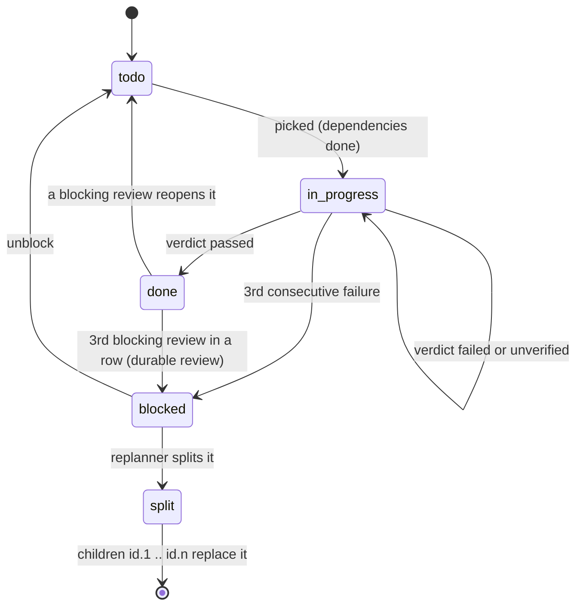

# The mission anchor

The mission anchor is the durable source of truth for a mission: a `.lha/` directory inside
the mission's git repository, committed together with the agent's code changes. The model's
context window is treated as a disposable cache; everything needed to resume lives here.

Implementation: [`python/src/lha/state/mission_anchor.py`](../python/src/lha/state/mission_anchor.py)
(`GitMissionAnchor`). Data model: [`python/src/lha/contracts/state.py`](../python/src/lha/contracts/state.py).
The Go mirror is [`go/internal/state/`](../go/internal/state/), and cross-implementation tests
check that each implementation reads the other's anchor identically.

## Layout

```text
<workdir>/                  a git repository (created with `git init -b main` if needed)
├── .lha/
│   ├── mission.json        immutable mission spec
│   ├── checklist.json      the checklist: items, statuses, dependencies
│   ├── progress.md         human-readable progress log, one line per cycle
│   ├── decisions.ndjson    append-only, hash-chained design-decision log
│   ├── events.ndjson       append-only event log
│   └── ownership.json      file-ownership map (only when the mission declared one)
└── ...                     the code being worked on
```

| File | Written | Format |
|---|---|---|
| `mission.json` | Once, at initialization | JSON (`MissionSpec`), indented |
| `checklist.json` | Every checkpoint (full rewrite) | JSON (`Checklist`), indented |
| `progress.md` | Every checkpoint (one entry appended) | Markdown |
| `decisions.ndjson` | Every checkpoint that has decisions (records chained on) | One chain envelope per line; older anchors may start with bare `DecisionRecord` lines |
| `events.ndjson` | Every checkpoint (records appended) | One `EventRecord` JSON object per line |
| `ownership.json` | At initialization, and by a checkpoint after the orchestrator staged a change | JSON (`FileOwnershipMap`), indented |

### `mission.json`

`MissionSpec`: `title`, `description`, `acceptance` (definition of done, may be empty),
`references` (workspace-relative paths of vendored, read-only reference material; may be empty),
`schema_version`. It is recited at the top of every cycle's system prompt, so the goal is the
same on cycle 1 and cycle 1000 regardless of how long `progress.md` gets. When `references` is
non-empty, the recital ends with the list under "Reference material (vendored, read-only;
consult it instead of guessing)". See [references](#references).

### `checklist.json`

`Checklist`: `items` and `schema_version`. Each `ChecklistItem` has:

| Field | Meaning |
|---|---|
| `id` | Zero-padded id assigned by the Planner (`01`, `02`, ...), by `run-local`, or by the checklist file; children of a split item are `<id>.1`, `<id>.2`, ... |
| `description` | The work to do |
| `status` | `todo`, `in_progress`, `blocked`, `done` or `split` |
| `verified_by` | Names of the gating checks that passed when the item became `done` |
| `depends_on` | Ids of items that must be `done` first |
| `attempts` | Verified attempts so far (success or failure) |
| `consecutive_failures` | Failed verifications since the last success or unblock |
| `last_failure` | The verifier's failure report from the latest failed attempt; shown to the model next cycle |
| `allow_harness_edits` | Opt-in for items that must modify existing tests or test config (see [verification](07-verification.md#harness-integrity)) |
| `witnesses` | The item's own acceptance checks (`go:TestX`, `pytest:<node>`, `cmd:<shell>`, `trusted:<name>`), which must pass in addition to the mission's checks (see [verification](07-verification.md#witnesses)) |
| `notes` | Free text, for example dependencies the Planner dropped as invalid, `split from <id>`, or why the Planner kept an item serial (see [file ownership](11-multi-agent-organization.md#file-ownership)) |
| `schema_version` | Format version |

The agent never edits the checklist. The harness loads it from `HEAD` at cycle start, changes it
in memory, and writes it at checkpoint.

### `progress.md`

Starts as `# Mission: <title>`, the description, a `## Progress` heading and
`- _initialized; no work yet._`. Each checkpoint appends one entry, for example:

```text
- c3 [01] Create hello.py ...: failed (attempt 3, status blocked)
```

When the replanner splits the item, the entry ends `; split into 01.1, 01.2`.

A passing cycle's entry ends in `verified`. The file is bounded at 16,000 characters: when it
grows past that, the oldest entries are removed and replaced with `- _(older entries trimmed)_`.
The header is kept.

### `decisions.ndjson`

The never-compacted record of design decisions (`DecisionRecord`: `decision`, `rationale`,
`alternatives_rejected`, `affected` (list), `cycle_id`), stored as a SHA-256 hash chain. The
format and the parsing/verification code are in
[`coordination/decision_log.py`](../python/src/lha/coordination/decision_log.py); the byte-level
cases are pinned in
[`spec/coordination/decision_chain.json`](../spec/coordination/decision_chain.json).

- **Line format.** Each line is `{"prev": <hex>, "hash": <hex>, "record": {...}}`, terminated
  by `\n`. `hash = sha256(prev + "\n" + canonical(record))`, where `canonical` is JSON with
  sorted keys, `(",", ":")` separators and non-ASCII characters left unescaped. The first
  line's `prev` is 64 zeros.
- **Legacy lines.** Anchors written before the chain existed hold bare `DecisionRecord` lines.
  These still load, but only as a leading prefix. Each one is folded into the running hash as if
  it were chained (`running = sha256(running + "\n" + canonical(line))`), so the first chained
  line's `prev` covers the whole prefix, and editing, reordering or deleting a legacy line after
  that breaks the chain. Until a chained line follows them, legacy lines have no integrity
  protection. A bare line after a chained one counts as tampering.
- **Verification.** The committed file is verified every time the situational snapshot is read
  and before every checkpoint adds to it. A failure (unreadable line, `prev` or `hash` mismatch,
  a bare line after the chain, or a final line without its `\n`) raises `DecisionChainError`.
  Nothing is committed on top of the altered log. `run-local`/`mission` and `orchestrate` stop
  with `stopped_reason` `decision log failed verification: <why>` and a `decision_chain_invalid`
  trace event, write status `ABORTED` to the mission row, and exit 1. On Temporal the cycle
  activity turns `DecisionChainError` into a non-retryable `ApplicationError` of type
  `MissionConfigError` with the message `decision log failed verification: <why>`
  (`_refuse_tampered_chain` in [`durable/activities.py`](../python/src/lha/durable/activities.py)),
  so it is not retried and the workflow does not park: it sets status `ABORTED` and fails with a
  non-retryable `ApplicationError` `mission <id> failed: decision log failed verification: ...`.
  The workflow writes `ABORTED` to the mission row (`record_mission_status`). `lha decisions
  --verify` prints the verdict ([CLI](17-cli.md#lha-decisions)).
- **Writing.** The agent records a decision with the `record_decision` tool (arguments
  `decision`, `rationale`, optional `alternatives_rejected` and `affected`).
  `build_lead_loop` ([`agent/assembly.py`](../python/src/lha/agent/assembly.py)) adds the tool
  to the Lead's dispatcher, bound to the mission anchor. Every run path builds its Lead there
  (`run-local`, `mission`, `orchestrate` and the Temporal cycle activity), so the Lead has the
  tool in all of them. The anchor
  keeps recorded decisions in memory (`record_decision`), not in the working tree. The cycle's
  checkpoint chains them onto the committed log and gives any record without a `cycle_id` the
  checkpoint's id, so the decisions land in the same commit as the work they describe. A cycle
  that ends without a checkpoint (for example a budget stop) drops them. Parallel implementers
  (in `orchestrate` and in a durable wave) record into their own buffer, and their decisions are
  committed only if the integrator merges their branch.
- **Reading.** The newest 5 records go into the situational snapshot (`last_decisions`). The
  Lead's prompt lists them under "Design decisions already recorded" on every cycle, and so do
  the parallel implementers' prompts.

### `ownership.json`

The `FileOwnershipMap` for missions whose plan declares files (`lha orchestrate`, and
`lha mission-start --max-parallel 2` or more): `owners` maps a normalized, case-folded path to
its single writer (`implementer-<item id>`). Unlisted files belong to the lead.
`initialize(ownership=...)` writes it. Without an ownership map no file is written (a
re-initialization without a map deletes a stale one), and `read_ownership()` returns an empty
map. Changes are staged with `stage_ownership()`; the next checkpoint writes them, after the
`.lha/` restore, so agent edits to this file are discarded like any other anchor edit. A granted
lease is written by a commit of its own that holds only `.lha/` files
(`commit_anchor_update()`). See [file ownership](11-multi-agent-organization.md#file-ownership)
and [leases](11-multi-agent-organization.md#leases).

### `events.ndjson`

`EventRecord`: `kind`, `cycle_id`, `payload` (object), `payload_ref` (object-store key for large
payloads, or `null`). Every cycle checkpoint appends a `cycle` event whose payload records the
item, the verdict, the resulting status, the tool-call count, `split_into` (child ids, empty
unless the item was split) and each check's name, pass/fail, gating flag, exit code and
duration. An integration checkpoint of a parallel wave adds `writer` and `branch` to its `cycle`
event and appends a `ticket` event (the ticket's id, item, role, write set, branch, status,
status history, ownership violations and leases). The multi-agent organization adds `research`,
`review`, `lease`, `orchestrate`, `blackboard` and `reflection` events
([wire contract](19-wire-contract.md#mission-anchor-lha)). A human-approved retry after a deadlock appends an
`unblock` event. Every tool call that reached an approval gate appends a `tool_approval` event
with the cycle's checkpoint (the tool, redacted arguments, reason, fingerprint, the decision
`approve`, `reject` or `pending`, who resolved it and whether the default applied); the local
terminal approver (`--approve-interactive`) also appends a `gate_reminder` event per reminder.

On Temporal, human gates also commit to the anchor. Each gate event (opened, reminder, resolved,
defaulted) is its own checkpoint with one event of kind `gate_opened`, `gate_reminder`,
`gate_resolved` or `gate_defaulted`, cycle id `gate:<gate id>`, the redacted gate question,
options, default, deadline and (for a tool-call gate) the pending action; the checklist is
rewritten unchanged. A mission declared impossible gets a final checkpoint with a
`mission_impossible` event (reason, blocked item ids, counts) and a `cycle` event. Exact payloads
are in the [wire contract](19-wire-contract.md#mission-anchor-lha).

## Item lifecycle



- **Picking.** `next_actionable()` returns an `in_progress` item if there is one, otherwise the
  first `todo` item whose `depends_on` are all `done`. `blocked` items are skipped, so
  independent items keep moving.
- **Success.** `record_success` sets `done`, records `verified_by`, and resets
  `consecutive_failures` and `last_failure`. It refuses an empty `verified_by`.
- **Failure.** `record_failure` increments `attempts` and `consecutive_failures` and stores the
  report in `last_failure`. When `consecutive_failures` reaches `max_consecutive_failures` the
  item becomes `blocked`. The `AgentLoop` uses 3; this is not an `LHA_*` setting.
- **Split.** When a failure blocks an item and a replanner is configured, the model is asked to
  break it into 2 to 6 smaller steps ([`agents/replanner.py`](../python/src/lha/agents/replanner.py)).
  `Checklist.split` inserts children `<id>.1` .. `<id>.n` after the parent: the first child
  inherits the parent's dependencies, each later child depends on the one before, the parent's
  witnesses move to the last child, and items that depended on the parent now depend on the last
  child. The parent becomes `split` and is never counted as done. Splitting is bounded by
  `LHA_MAX_REPLANS` (splits per mission, default 20; 0 disables) and `LHA_MAX_SPLIT_DEPTH`
  (default 2, counted as dots in the id). A reply with fewer than two usable steps means no
  split, and the item stays `blocked`.
- **Unblock.** `unblock` returns a `blocked` item to `todo` and resets `consecutive_failures`.
  On Temporal this happens when a human answers `retry` to the deadlock gate (activity
  `unblock_items`, sent with `lha mission-approve <id> --decision retry`); the local runners have
  no unblock command.

## Complete versus deadlocked

The two terminal predicates are distinct, and "nothing to do" is never read as success:

- `is_complete`: at least one item is `done` and every item is `done` or `split`. An empty
  checklist is not complete. Progress counts (`items_done` / `items_total`) exclude `split`
  parents, because their children replace them.
- `is_deadlocked`: not complete, and no item is actionable. `deadlock_reason()` explains why:
  `blocked: <ids>`, dependency errors (duplicate ids, unknown or self dependencies, cycles),
  `checklist has no items`, or open items waiting on dependencies that can never complete.

Initialization rejects a checklist with dependency errors. The local runners report
`deadlocked: <reason>` and exit 1. `MissionWorkflow` with no deadlock gate
(`deadlock_gate_seconds` 0) ends with outcome `deadlocked` and status `IMPOSSIBLE`; with a gate,
a human (or the gate's default on timeout) chooses `retry`, `abort` (outcome `aborted`, status
`ABORTED`) or `impossible` (outcome `impossible`, status `IMPOSSIBLE`, after a final
checkpoint). See [Running on Temporal](14-running-on-temporal.md#5-gates-sleep-and-abort).

## Checkpoints

A checkpoint is one commit containing both the code changes and the updated anchor.
`commit_checkpoint`:

1. Verifies the committed decision chain (raises `DecisionChainError` if it fails).
2. Restores `.lha/` to `HEAD` (`git checkout HEAD -- .lha` and `git clean` of `.lha`), discarding
   anything the agent wrote there during the cycle.
3. Writes `checklist.json` from the harness's in-memory checklist, appends the progress entry
   to the committed `progress.md`, and writes `ownership.json` if a map was staged.
4. Rebuilds `decisions.ndjson` as the committed chain plus the queued and checkpoint decisions,
   chained on, and `events.ndjson` as the committed content plus the new records. Because the
   logs are rebuilt from `HEAD` rather than appended to the working file, repeating a checkpoint
   does not duplicate lines.
5. Stages everything with `git add -A`, then force-adds whichever of the six anchor files exist
   with `git add -f`, so they are committed even if the repository's `.gitignore` excludes
   `.lha/`.
6. Commits, or returns the current `HEAD` if nothing changed. If a merge is in progress (the
   integration of a parallel wave), this commit is the merge commit.

The agent is told not to edit `.lha/`, the dispatcher refuses tool writes to it, and the Docker
sandbox mounts it read-only; the restore in step 2 covers anything that gets past those.

Reads use the same rule: anchor files are read from `HEAD`, and fall back to the working tree
only for a file that has never been committed.

## Assume interruption

Every cycle begins by reconstructing its situation from the anchor and `git log` (the
`SituationSnapshot`: head sha, last 10 commits, mission spec, progress text, open items, last
decisions, active item, completion and deadlock state). Nothing carries over in the model's
context from the previous cycle. A restart after a crash is therefore handled the same way as
any other cycle start.

On Temporal, each cycle attempt additionally resets the checkout to `HEAD` before starting
(`git reset --hard` and `git clean -ffdx`, keeping `.venv`, `venv`, `node_modules`, `.env*` and
`.lha/objects`), so partial edits from a crashed attempt are never committed. See
[durable execution](08-durable-execution.md).

## Importing a checklist

Instead of letting the Planner decompose a task, `lha run-local`, `lha mission` and
`lha mission-start` accept `--checklist FILE`
([`state/checklist_import.py`](../python/src/lha/state/checklist_import.py)). The format is chosen
by extension:

- **`.json`**: a `Checklist` dump, a bare list of items, or a mission file with optional
  `title`, `description`, `references` and an `items` list. Item fields are those of
  `ChecklistItem` (unknown fields are rejected); items without an `id` get zero-padded ids by
  position.
- **`.md`**: a roadmap. The first `# ` heading is the title; text before the first `## ` is the
  description; each `## ` section is a phase; each `- [ ] text` line is an item (`- [x]` lines are
  skipped). Indented lines under a checkbox continue its description. Witnesses are written
  inline, `(witness: go:TestX)` or `(witnesses: go:TestX, trusted:e2e)`, and removed from the
  description. Every item in a phase depends on every item of the nearest earlier phase that has
  items; items within a phase are independent.

Ids, dependencies and witness syntax are validated before anything runs; an error names the file
(and the line, for Markdown). A title, description or references given on the command line take
precedence over (or, for `--reference`, are merged with) the file's.

```markdown
# Hello service

A small Go module with one greeting function.

## Core
- [ ] Add greet.Hello returning "hello" (witness: go:TestHello)

## CLI
- [ ] Add a hello command that prints the greeting (witness: trusted:e2e)
```

## References

A mission can list reference material the agent should read instead of guessing: API docs,
schemas, SDK notes. `lha vendor URL... --into DIR` downloads the pages into `DIR` (default
`reference`) and writes `DIR/MANIFEST.json` with each file's URL, path, SHA-256, size, content
type and fetch time; HTML pages also get a `.txt` rendering
([`state/vendor.py`](../python/src/lha/state/vendor.py)). Fetching follows the same egress rules as
`fetch_url` (http(s) only, public addresses only, at most 10,000,000 bytes per page, at most 5 redirects), and every redirect must
stay on a host among the URLs given. Run it from the workspace (or pass a path inside it), then
pass the workspace-relative paths with `--reference` (repeatable) or list them in a JSON
checklist's `references`. They are stored in `mission.json` and recited every cycle; the agent
reads them offline with its file tools.

