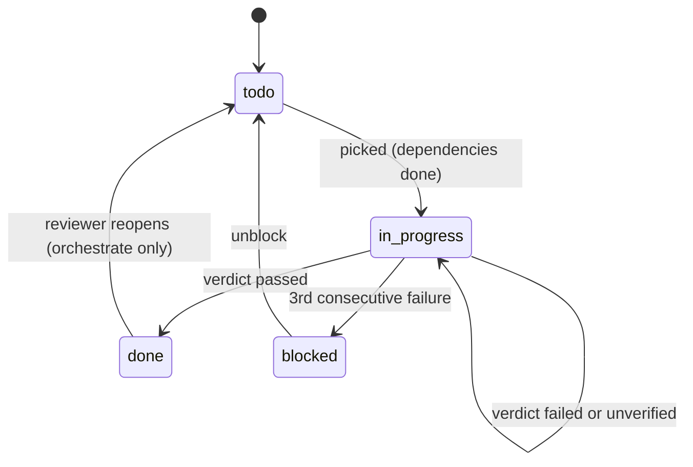

# The mission anchor

The mission anchor is the durable source of truth for a mission: a `.lha/` directory inside
the mission's git repository, committed together with the agent's code changes. The model's
context window is treated as a disposable cache; everything needed to resume lives here.

Implementation: [`python/src/lha/state/mission_anchor.py`](../python/src/lha/state/mission_anchor.py)
(`GitMissionAnchor`). Data model: [`python/src/lha/contracts/state.py`](../python/src/lha/contracts/state.py).
The Go mirror is [`go/internal/state/`](../go/internal/state/), and cross-implementation tests
check that each implementation reads the other's anchor identically.

## Layout

```text
<workdir>/                  a git repository (created with `git init -b main` if needed)
├── .lha/
│   ├── mission.json        immutable mission spec
│   ├── checklist.json      the checklist: items, statuses, dependencies
│   ├── progress.md         human-readable progress log, one line per cycle
│   ├── decisions.ndjson    append-only design-decision log
│   └── events.ndjson       append-only event log
└── ...                     the code being worked on
```

| File | Written | Format |
|---|---|---|
| `mission.json` | Once, at initialization | JSON (`MissionSpec`), indented |
| `checklist.json` | Every checkpoint (full rewrite) | JSON (`Checklist`), indented |
| `progress.md` | Every checkpoint (one entry appended) | Markdown |
| `decisions.ndjson` | Every checkpoint (records appended) | One `DecisionRecord` JSON object per line |
| `events.ndjson` | Every checkpoint (records appended) | One `EventRecord` JSON object per line |

### `mission.json`

`MissionSpec`: `title`, `description`, `acceptance` (definition of done, may be empty),
`schema_version`. It is recited at the top of every cycle's system prompt, so the goal is the
same on cycle 1 and cycle 1000 regardless of how long `progress.md` gets.

### `checklist.json`

`Checklist`: `items` and `schema_version`. Each `ChecklistItem` has:

| Field | Meaning |
|---|---|
| `id` | Zero-padded id assigned by the Planner (`01`, `02`, ...) or by `run-local` |
| `description` | The work to do |
| `status` | `todo`, `in_progress`, `blocked` or `done` |
| `verified_by` | Names of the gating checks that passed when the item became `done` |
| `depends_on` | Ids of items that must be `done` first |
| `attempts` | Verified attempts so far (success or failure) |
| `consecutive_failures` | Failed verifications since the last success or unblock |
| `last_failure` | The verifier's failure report from the latest failed attempt; shown to the model next cycle |
| `allow_harness_edits` | Opt-in for items that must modify existing tests or test config (see [verification](07-verification.md#harness-integrity)) |
| `notes` | Free text, for example dependencies the Planner dropped as invalid |
| `schema_version` | Format version |

The agent never edits the checklist. The harness loads it from `HEAD` at cycle start, changes it
in memory, and writes it at checkpoint.

### `progress.md`

Starts as `# Mission: <title>`, the description, a `## Progress` heading and
`- _initialized; no work yet._`. Each checkpoint appends one entry, for example:

```text
- c3 [01] Create hello.py ...: failed (attempt 3, status blocked)
```

A passing cycle's entry ends in `verified`. The file is bounded at 16,000 characters: when it
grows past that, the oldest entries are removed and replaced with `- _(older entries trimmed)_`.
The header is kept.

### `decisions.ndjson`

`DecisionRecord`: `decision`, `rationale`, `alternatives_rejected`, `affected` (list), `cycle_id`.
The last 5 records are included in the situational snapshot. The file is never compacted.
The checkpoint API accepts decision records, but no current run path produces them, so in
practice this file stays empty. (A separate hash-chained decision log exists in
[`coordination/decision_log.py`](../python/src/lha/coordination/decision_log.py); it does not
write to this file.)

### `events.ndjson`

`EventRecord`: `kind`, `cycle_id`, `payload` (object), `payload_ref` (object-store key for large
payloads, or `null`). Every cycle checkpoint appends a `cycle` event whose payload records the
item, the verdict, the resulting status, the tool-call count and each check's name, pass/fail,
gating flag, exit code and duration. A human-approved retry after a deadlock appends an
`unblock` event.

## Item lifecycle



- **Picking.** `next_actionable()` returns an `in_progress` item if there is one, otherwise the
  first `todo` item whose `depends_on` are all `done`. `blocked` items are skipped, so
  independent items keep moving.
- **Success.** `record_success` sets `done`, records `verified_by`, and resets
  `consecutive_failures` and `last_failure`. It refuses an empty `verified_by`.
- **Failure.** `record_failure` increments `attempts` and `consecutive_failures` and stores the
  report in `last_failure`. When `consecutive_failures` reaches `max_consecutive_failures` the
  item becomes `blocked`. The `AgentLoop` uses 3; this is not an `LHA_*` setting.
- **Unblock.** `unblock` returns a `blocked` item to `todo` and resets `consecutive_failures`.
  On Temporal this happens when a human answers `retry` to the deadlock gate (activity
  `unblock_items`); there is no CLI command for it.

## Complete versus deadlocked

The two terminal predicates are distinct, and "nothing to do" is never read as success:

- `is_complete`: the checklist has at least one item and every item is `done`. An empty
  checklist is not complete.
- `is_deadlocked`: not complete, and no item is actionable. `deadlock_reason()` explains why:
  `blocked: <ids>`, dependency errors (duplicate ids, unknown or self dependencies, cycles),
  `checklist has no items`, or open items waiting on dependencies that can never complete.

Initialization rejects a checklist with dependency errors. The local runners report
`deadlocked: <reason>` and exit 1; `MissionWorkflow` ends with outcome `deadlocked` and status
`IMPOSSIBLE`.

## Checkpoints

A checkpoint is one commit containing both the code changes and the updated anchor.
`commit_checkpoint`:

1. Restores `.lha/` to `HEAD` (`git checkout HEAD -- .lha` and `git clean` of `.lha`), discarding
   anything the agent wrote there during the cycle.
2. Writes `checklist.json` from the harness's in-memory checklist and appends the progress entry
   to the committed `progress.md`.
3. Rebuilds `decisions.ndjson` and `events.ndjson` as the committed content plus the new records.
   Because the logs are rebuilt from `HEAD` rather than appended to the working file, repeating a
   checkpoint does not duplicate lines.
4. Stages everything with `git add -A`, then force-adds the five anchor files with `git add -f`,
   so they are committed even if the repository's `.gitignore` excludes `.lha/`.
5. Commits, or returns the current `HEAD` if nothing changed.

The agent is told not to edit `.lha/`, the dispatcher refuses tool writes to it, and the Docker
sandbox mounts it read-only; the restore in step 1 covers anything that gets past those.

Reads use the same rule: anchor files are read from `HEAD`, and fall back to the working tree
only for a file that has never been committed.

## Assume interruption

Every cycle begins by reconstructing its situation from the anchor and `git log` (the
`SituationSnapshot`: head sha, last 10 commits, mission spec, progress text, open items, last
decisions, active item, completion and deadlock state). Nothing carries over in the model's
context from the previous cycle. A restart after a crash is therefore handled the same way as
any other cycle start.

On Temporal, each cycle attempt additionally resets the checkout to `HEAD` before starting
(`git reset --hard` and `git clean -ffdx`, keeping `.venv`, `venv`, `node_modules`, `.env*` and
`.lha/objects`), so partial edits from a crashed attempt are never committed. See
[durable execution](08-durable-execution.md).
