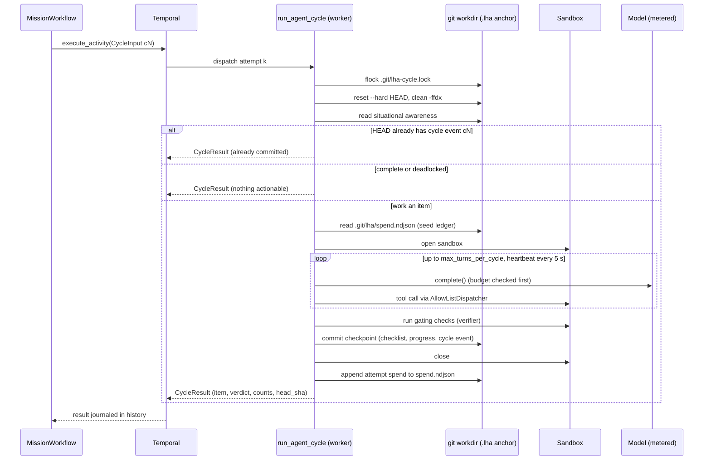

# Durable execution

The durable path runs a mission as a Temporal workflow. The workflow body is a deterministic
scheduler. The real work (model calls, tool calls in the sandbox, verification, git commits)
happens inside activities. Code: [`python/src/lha/durable/`](../python/src/lha/durable/).

The Go port does not have a Temporal layer yet. Use the Python worker for everything on this
page.

## Components

| Piece | File | Role |
|---|---|---|
| `MissionWorkflow` | [workflows.py](../python/src/lha/durable/workflows.py) | One long-lived workflow per mission (id `mission:<mission_id>`) |
| `SubAgentWorkflow` | [subagent_workflow.py](../python/src/lha/durable/subagent_workflow.py) | Child workflow that runs one sub-agent activity |
| Activities | [activities.py](../python/src/lha/durable/activities.py), [agent_activities.py](../python/src/lha/durable/agent_activities.py) | Non-deterministic work |
| Types | [types.py](../python/src/lha/durable/types.py) | Plain dataclasses that cross the Temporal boundary |
| Names | [signals.py](../python/src/lha/durable/signals.py) | Versioned signal and query names, status constants |
| Worker | [worker.py](../python/src/lha/durable/worker.py) | `lha worker` / `python -m lha.durable.worker` |
| Codec | [codec.py](../python/src/lha/durable/codec.py), [data_converter.py](../python/src/lha/durable/data_converter.py) | ClaimCheck payload offload |

The worker registers both workflows and these activities (Temporal activity type = function name):

| Activity | Called by | Timeout / retry | What it does |
|---|---|---|---|
| `run_agent_cycle` | `MissionWorkflow`, every cycle | start-to-close 1 h, heartbeat 2 min, retry policy below | Advances the mission by one checklist item |
| `check_mission_health` | `MissionWorkflow`, while parked | start-to-close 2 min, 1 attempt | Probes git, model config and sandbox |
| `unblock_items` | `MissionWorkflow`, after a human "retry" | start-to-close 5 min, 3 attempts | Resets every `blocked` item to `todo` and commits |
| `read_mission_snapshot` | `MissionWorkflow`, terminal path | start-to-close 2 min, 3 attempts | Reads checklist counts and HEAD when no cycle has reported yet |
| `run_subagent` | `SubAgentWorkflow` | start-to-close 15 min, heartbeat 2 min, 3 attempts | Runs one role as a `SubAgent` |

Workflow `run` methods take exactly one argument. Temporal only applies type hints when the payload
count matches the parameter count, so the state carried across Continue-As-New rides inside
`MissionInput.state` rather than as a second parameter.

## The cycle activity

`run_agent_cycle` retry policy: initial interval 1 s, backoff 2.0, maximum interval 30 s,
maximum 5 attempts. `BudgetExceeded` and `MissionConfigError` are non-retryable.

Temporal journals an activity's result, not the work inside it. A completed cycle is never re-run
on replay. An attempt that crashed is retried from scratch, and its model calls are paid for
again. Each attempt is made safe to repeat:

- **Workdir lock.** An exclusive `flock` on `.git/lha-cycle.lock`. A second attempt (for example a
  zombie attempt after a heartbeat timeout, and its retry) waits up to 300 s, heartbeating while it
  waits, then fails with the retryable `WorkdirBusyError`.
- **Clean start.** Each attempt runs `git reset --hard` and `git clean -ffdx` to HEAD first, so
  partial edits from a crashed attempt are discarded, not committed.
- **Exactly-once commit per cycle id.** Cycle ids are `c<n>`, derived from `cycles_done`. If one of
  the last 64 events in `HEAD:.lha/events.ndjson` is a `cycle` event with this id, the previous
  attempt committed and then crashed before reporting. The attempt returns that result instead of
  working another item.
- **Heartbeats.** Sent every 5 s while the agent loop runs, so a dead worker is detected after the
  2-minute heartbeat timeout rather than the 1-hour start-to-close timeout.
- **Spend journal.** Each attempt appends its spend to `.git/lha/spend.ndjson`. This file is outside
  the worktree, so the reset does not remove it. The next attempt's ledger starts from that
  total. See [Cost and budget](10-cost-and-budget.md).

Model, sandbox, budget ceiling and checks come from the worker's settings (`get_settings()` is
cached per process), except `check_commands` and `budget_usd`, which come from `MissionInput`.
A missing API key or a refused sandbox raises a non-retryable `MissionConfigError`.



## Workflow loop and outcomes

Each iteration: stop at `max_cycles`, otherwise run one cycle and absorb its result
(`head_sha`, `items_done`, `items_total`, `last_item`). The mission ends with an explicit outcome:

| Outcome | Trigger | Final status |
|---|---|---|
| `completed` | `is_complete`: every checklist item verified done | `DONE` |
| `deadlocked` | `is_deadlocked`: items remain, none actionable, and no human "retry" | `IMPOSSIBLE` |
| `budget_exhausted` | the cycle activity raised `BudgetExceeded` | `ABORTED` |
| `max_cycles` | `cycles_done >= max_cycles` | `ABORTED` |
| `aborted` | defined in `types.py`, never produced by `MissionWorkflow` today | `ABORTED` |

Any other non-retryable activity error (for example `MissionConfigError`) fails the workflow with
an `ApplicationError`. `MissionInput` is validated first: an explicitly empty `check_commands`,
`cycles_before_can < 1` or `max_cycles < 0` fail the workflow before any cycle runs.

## Parking on degraded dependencies

When `run_agent_cycle` exhausts its retries on a retryable error, the workflow parks instead of
failing. It sets status `DEGRADED_PARK` and increments `parks`. Then it repeats: durable
`workflow.sleep(delay)`, then `check_mission_health`, until the probe reports healthy. The delay
starts at `park_initial_seconds` (default 60), doubles after each unhealthy probe, and is capped at
`park_max_seconds` (default 3600). Then status returns to `RUNNING` and the same cycle id is
retried.

The probe ([`probe_health`](../python/src/lha/durable/activities.py)) checks three dependencies
and passes them to `decide_safe_park` ([ops/degradation.py](../python/src/lha/ops/degradation.py)),
which parks only if a critical dependency (`git`, `model`, `sandbox`) is `DOWN`:

- `git`: the workdir is a repository with at least one commit.
- `model`: `build_provider(settings)` succeeds. This is a configuration check. No model request is
  sent, so an unreachable provider still counts as healthy. The park then ends after one sleep,
  and the cycle is retried.
- `sandbox`: a sandbox session opens and closes.

## Deadlock and the human gate

A deadlock is "not complete, but nothing actionable". This happens when items are `blocked` after
repeated verification failures, or when dependencies can never be satisfied. If
`MissionInput.deadlock_gate_seconds` is 0 (the default), the mission ends immediately as
`deadlocked`. Otherwise the workflow calls `await_human_gate` with the options `retry` / `abort`
and the default `abort`:

- status is `WAITING_ON_HUMAN` while the gate is open, and restored afterwards;
- a decision that arrived before the gate opened is honoured (it is stored until consumed);
- matching is case-insensitive; a decision that matches no option is recorded in
  `rejected_decisions`, and the gate keeps waiting;
- on timeout the default is applied.

On `retry` the workflow runs `unblock_items` (cycle id `u<n>`) and continues if at least one item
was unblocked. `lha mission-start` does not set `deadlock_gate_seconds`, so missions started from
the CLI never open this gate. `lha mission-approve` sends `approve` by default, which this gate
rejects. Send `--decision retry` or `--decision abort` instead.

## Signals, queries and statuses

| Name (wire) | Kind | Payload / result |
|---|---|---|
| `human_decision_v1` | signal | decision string, held until a gate consumes it |
| `steer_v1` | signal | note appended to `steer_notes` (max 20 notes, 2000 chars each); every following cycle's prompt includes them |
| `status_v1` | query | current status string |
| `cycles_done` | query | completed cycle count |
| `last_item` | query | id of the last worked item |
| `park_reason` | query | why the mission is parked (`""` if not) |
| `rejected_decisions` | query | decisions discarded by a gate |

`signals.py` also defines `UPDATE_VERIFY_VERDICT = "verify_verdict_v1"`. No workflow registers
an update handler for it. It also defines status `SLEEPING`, which `MissionWorkflow` never sets.
The statuses the workflow actually uses are `RUNNING`, `DEGRADED_PARK`, `WAITING_ON_HUMAN`,
`DONE`, `IMPOSSIBLE` and `ABORTED`. The CLI covers `mission-status` (`status_v1` +
`cycles_done`), `mission-approve` (`human_decision_v1`) and `mission-abort` (workflow
cancellation). There is no CLI command for `steer_v1`.

## Continue-As-New

The workflow continues as new every `cycles_before_can` cycles (default 200). It also does so
whenever Temporal reports `is_continue_as_new_suggested()`, including between park probes. The
new run receives the same `MissionInput` with `state` set to the current `MissionState`:
`cycles_done`, `status`, `head_sha`, `items_done`, `items_total`, `last_item`,
`pending_decision`, `steer_notes`, `parks` and `deadlock_retries`. Nothing else is carried: no
history and no transcripts. `rejected_decisions` and `park_reason` are instance fields and reset in
the new run. A run that continued as new during a park starts with a cycle attempt, not another
sleep.

## Idempotency

- Workflow id is `mission:<mission_id>`. `start_mission()` in `worker.py` relies on Temporal
  rejecting a duplicate id. `lha mission-start` mints a new mission id on every invocation, so
  running it twice starts two missions.
- Cycle commits are exactly-once per cycle id (see above).
- Spend journal rows are keyed by `idempotency_key(mission_id, cycle_id, attempt)`. Readers keep
  the last row per key and skip a torn final line.
- Sub-agent child ids are `subagent:<mission>:<role>:<workflow.uuid4()[:12]>`. They are
  deterministic under replay and unique across fan-outs.

## Sub-agent fan-out

`research_children()` starts one `SubAgentWorkflow` per input concurrently. It returns every
output and every failure (as `role: ExceptionType: message`), and re-raises cancellation.
`run_subagent` builds its own `CostMeter` from the worker's `budget_usd_ceiling`. That meter is not
seeded from the mission's spend journal. `MissionWorkflow` does not call `research_children` today.
The fan-out is implemented and tested
([test_subagent_fanout.py](../python/tests/durability/test_subagent_fanout.py)) but not part of
the mission loop.

## ClaimCheck payload codec

`ClaimCheckCodec` replaces any payload larger than 32 KiB with a pointer. The pointer has encoding
`lha/claimcheck/v2` and its data is the object key. The codec stores the whole serialized
`Payload` (data and all metadata), so decoding restores it byte for byte. v1 pointers
(`lha/claimcheck`) still decode. `build_data_converter()` installs the codec. The client
(`connect_client`), every worker and the replayer must use the same converter and the same
object store root (`LHA_OBJECT_STORE_ROOT`, default `.lha/objects`).

The only store is `LocalFileObjectStore`
([object_store.py](../python/src/lha/persistence/object_store.py)):

- the key is the SHA-256 of the blob, validated as 64 lowercase hex characters before it touches
  the filesystem;
- the root is resolved to an absolute path at construction;
- writes are atomic (temp file, `fsync`, `os.replace`);
- reads re-hash the blob and raise `ObjectCorruptError` on a mismatch.

Blobs are stored in plaintext. The module docstring mentions an S3 adapter, but none exists.
Workers on different hosts need a shared filesystem at the store root.

## Replay safety net

[`replay_test_harness.py`](../python/src/lha/durable/replay_test_harness.py) replays every
`*.json` history in a directory against the current `MissionWorkflow` and `SubAgentWorkflow`
code, using the worker's data converter. [`test_replay.py`](../python/tests/durability/test_replay.py)
has three tests:

- `test_fresh_history_replays`: records a three-item mission on the time-skipping test server and
  replays it;
- `test_recorded_histories_still_replay`: replays the committed
  [`histories/mission_three_items.json`](../python/tests/durability/histories/);
- `test_replay_detects_a_changed_workflow`: renames `run_agent_cycle` in a copy of the history and
  expects a non-determinism error.

CI runs these tests with `tests/durability`. If a workflow change is intentionally incompatible
and ships behind a new worker build, re-record the history from `python/`:

```bash
LHA_RECORD_HISTORY=1 uv run pytest tests/durability/test_replay.py
```

Recording rewrites machine-specific paths in payloads (the workdir becomes `/workspace/mission`,
the interpreter becomes `python3`) so the committed history is portable. The code does not
configure worker versioning or Build IDs. Pinning builds is an operational step outside the
repository. See [Running on Temporal](14-running-on-temporal.md) and the
[operations runbook](15-operations-runbook.md).

## Implemented but not wired into `MissionWorkflow`

[`reconcile.py`](../python/src/lha/durable/reconcile.py) (adopt or re-spawn in-progress tickets
from real git branch state), [`saga.py`](../python/src/lha/durable/saga.py) (LIFO compensation
stack) and [`ledgers.py`](../python/src/lha/durable/ledgers.py) (`TaskLedger`, stall-detecting
`ProgressLedger`) have tests, but no workflow calls them.
