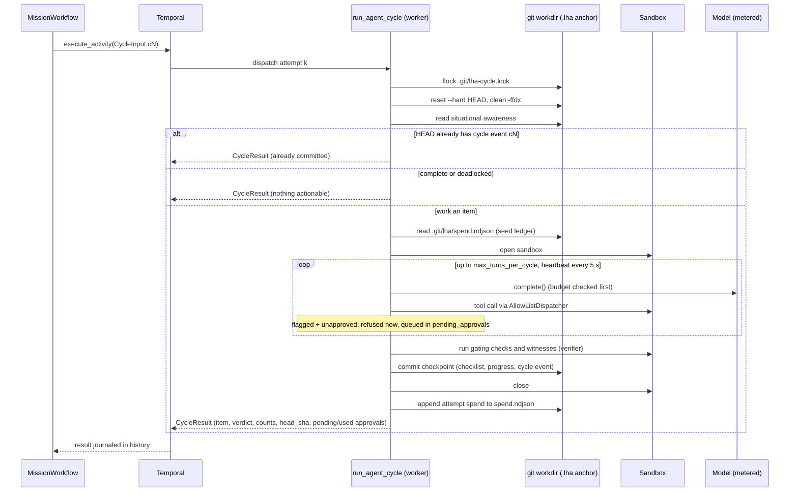
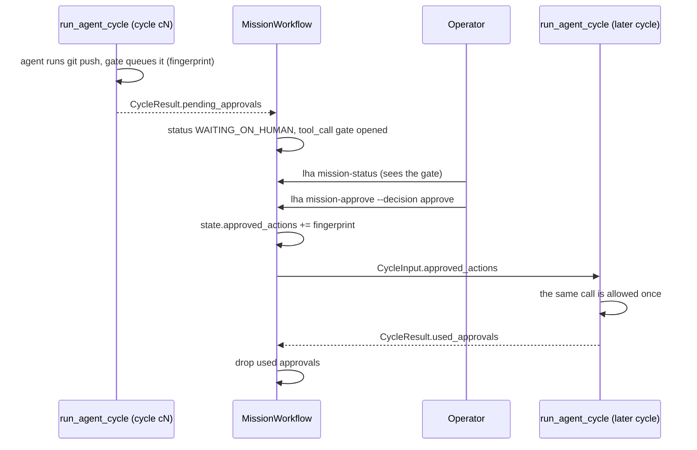

# Durable execution

The durable path runs a mission as a Temporal workflow. The workflow body is a deterministic
scheduler. The real work (model calls, tool calls in the sandbox, verification, git commits)
happens inside activities. Code: [`python/src/lha/durable/`](../python/src/lha/durable/).

The Go port ([`go/internal/durable/`](../go/internal/durable/)) implements the same workflow,
the organization (research, review, parallel waves) and `run_subagent` included, under the same
names and payloads. The two implementations' workers must not share a task queue: see
[the Go worker](#the-go-worker).

## Components

| Piece | File | Role |
|---|---|---|
| `MissionWorkflow` | [workflows.py](../python/src/lha/durable/workflows.py) | One long-lived workflow per mission (id `mission:<mission_id>`) |
| `SubAgentWorkflow` | [subagent_workflow.py](../python/src/lha/durable/subagent_workflow.py) | Child workflow that runs one sub-agent activity (the researchers of the [organization](#the-multi-agent-organization-opt-in)) |
| Organization round | [org_round.py](../python/src/lha/durable/org_round.py) | Workflow code for one round of research, a Lead cycle or a parallel wave, and review, when a mission opts in |
| Activities | [activities.py](../python/src/lha/durable/activities.py), [agent_activities.py](../python/src/lha/durable/agent_activities.py), [org_activities.py](../python/src/lha/durable/org_activities.py) | Non-deterministic work |
| Types | [types.py](../python/src/lha/durable/types.py) | Plain dataclasses that cross the Temporal boundary |
| Names | [signals.py](../python/src/lha/durable/signals.py) | Versioned signal and query names, status constants |
| Worker | [worker.py](../python/src/lha/durable/worker.py) | `lha worker` / `python -m lha.durable.worker`; identity `lha-py:<pid>@<host>`, refuses a task queue a Go worker polls ([the Go worker](#the-go-worker)) |
| Codec | [codec.py](../python/src/lha/durable/codec.py), [data_converter.py](../python/src/lha/durable/data_converter.py) | ClaimCheck payload offload |

The worker registers both workflows and these activities (Temporal activity type = function name):

| Activity | Called by | Timeout / retry | What it does |
|---|---|---|---|
| `run_agent_cycle` | `MissionWorkflow`, every cycle | start-to-close 1 h, heartbeat 2 min, retry policy below | Advances the mission by one checklist item |
| `check_mission_health` | `MissionWorkflow`, while parked | start-to-close 2 min, 1 attempt | Probes git, the model (a real request) and the sandbox |
| `unblock_items` | `MissionWorkflow`, after a human "retry" | start-to-close 5 min, 3 attempts | Resets every `blocked` item to `todo` and commits |
| `notify_gate` | `MissionWorkflow`, on every gate event | start-to-close 3 min, 3 attempts | Commits a `gate_<event>` event to the anchor, writes the gate's `hitl_gates` row (`lha gates`) and POSTs it to the optional webhook |
| `declare_impossible` | `MissionWorkflow`, after an "impossible" decision | start-to-close 5 min, 3 attempts | Final checkpoint: `mission_impossible` event, progress entry, commit `lha: mission declared impossible` |
| `read_mission_snapshot` | `MissionWorkflow`, terminal path | start-to-close 2 min, 3 attempts | Reads checklist counts and HEAD when no cycle has reported yet |
| `record_mission_status` | `MissionWorkflow`, on a status only it knows | 30 s per attempt, 3 attempts within 2 min | Upserts the mission row (see below) |
| `run_subagent` | `SubAgentWorkflow` | start-to-close 15 min, heartbeat 2 min, 3 attempts | Runs one role as a `SubAgent` |
| `plan_round` | an organization round | start-to-close 5 min, 3 attempts | Picks a parallel wave or the next item from the committed checklist and ownership map; removes an interrupted wave's worktrees, branches and cached results |
| `run_implementer` | a parallel wave, one per item | start-to-close 1 h, heartbeat 2 min, the cycle retry policy | One implementer in its own git worktree; commits on its branch |
| `integrate_branch` | a parallel wave, one per item | start-to-close 1 h, heartbeat 2 min, the cycle retry policy | Merges one implementer branch and commits the checkpoint |
| `review_cycle` | an organization round, after a verified item | start-to-close 1 h, heartbeat 2 min, the cycle retry policy | Independent review; a blocking review reopens the item |

Workflow `run` methods take exactly one argument. Temporal only applies type hints when the payload
count matches the parameter count, so the state carried across Continue-As-New rides inside
`MissionInput.state` rather than as a second parameter.

## The cycle activity

`run_agent_cycle` retry policy: initial interval 1 s, backoff 2.0, maximum interval 30 s,
maximum 5 attempts. `BudgetExceeded` and `MissionConfigError` are non-retryable. A
`.lha/decisions.ndjson` that fails hash-chain verification (`DecisionChainError`) is raised as a
non-retryable `MissionConfigError` (`decision log failed verification: ...`): retrying cannot fix
an altered log, so the mission fails instead of retrying and parking.

Temporal journals an activity's result, not the work inside it. A completed cycle is never re-run
on replay. An attempt that crashed is retried from scratch, and its model calls are paid for
again. Each attempt is made safe to repeat:

- **Workdir lock.** An exclusive `flock` on `.git/lha-cycle.lock`. A second attempt (for example a
  zombie attempt after a heartbeat timeout, and its retry) waits up to 300 s, heartbeating while it
  waits, then fails with the retryable `WorkdirBusyError`.
- **Clean start.** Each attempt runs `git reset --hard` and `git clean -ffdx` to HEAD first, so
  partial edits from a crashed attempt are discarded, not committed. Ignored files go too, except
  `.venv`, `venv`, `node_modules`, `.env*`, `.lha/objects` and the paths in `LHA_RESET_KEEP`
  (for example a build cache or a local git remote).
- **Exactly-once commit per cycle id.** Cycle ids are `c<n>`, derived from `cycles_done`. If one of
  the last 256 events in `HEAD:.lha/events.ndjson` is a `cycle` event with this id, the previous
  attempt committed and then crashed before reporting. The attempt returns that result instead of
  working another item.
- **Heartbeats.** Sent every 5 s while the agent loop runs, so a dead worker is detected after the
  2-minute heartbeat timeout rather than the 1-hour start-to-close timeout.
- **Spend journal.** Each attempt appends its spend to `.git/lha/spend.ndjson`. This file is outside
  the worktree, so the reset does not remove it. The next attempt's ledger starts from that
  total. See [Cost and budget](10-cost-and-budget.md).

The lead is assembled by [`agent/assembly.py`](../python/src/lha/agent/assembly.py), the same
code the local runners use. Model, sandbox kind and image, sandbox egress, the web allow-list and web settings,
trusted checks, flaky-check retries, the mutation gate (`LHA_MUTATION_CHECK`,
`LHA_MUTATION_TIMEOUT_S`), protected harness paths, replanning limits and budget ceiling come
from the worker's settings (`get_settings()` is cached per process), except `check_commands` and
`budget_usd`, which come from `MissionInput`. A missing API key, a refused sandbox or malformed
`LHA_TRUSTED_CHECKS` raises a non-retryable `MissionConfigError`. Trusted checks run on the
worker host.

The activity also opens the mission store (SQLite, or Postgres when `LHA_POSTGRES_DSN` is set; see
[Configuration](18-configuration.md)) and the tiered memory service. Every metered call of the
attempt is written to the cost ledger under the key prefix `<cycle id>@<attempt>`, and the mission
row's status is set from the committed checklist after the cycle: `DONE`, `WAITING_ON_HUMAN` (the
cycle queued an approval) or `RUNNING` (also when deadlocked: whether that ends the mission is
the workflow's decision), and `ABORTED` when the budget is exhausted. The workflow itself never
touches a database: the statuses only it knows reach the row through the `record_mission_status`
activity, which opens the store the same way and upserts the row (idempotent): `SLEEPING`,
`DEGRADED_PARK`, `WAITING_ON_HUMAN` when a gate opens, and the final status of every ending,
including `IMPOSSIBLE` for a deadlock, a gate decision, `max_cycles`, a non-retryable failure and
a cancellation (written from a handler that runs after the cancel; a cycle in flight is waited
for first, `lha-cycle-wait-cancel-v1`, and so is every activity of an organization round). The store never moves a row from `DONE`, `IMPOSSIBLE` or
`ABORTED` back to a non-terminal status, so a late write from a finishing cycle cannot undo an
abort. It is best effort: 30 s per attempt, three attempts within two minutes, then the workflow
logs a warning and goes on. An unusable Postgres store falls back to SQLite with a warning; with
`LHA_POSTGRES_FALLBACK_TO_SQLITE=false` it is a non-retryable `MissionConfigError` instead.



## Workflow loop and outcomes

Each iteration: stop at `max_cycles`, otherwise sleep while `resume_at` is in the future
([SLEEPING](#sleeping)), run one cycle (or, for a mission that opted in, one
[organization round](#the-multi-agent-organization-opt-in)), absorb its result (`head_sha`,
`items_done`, `items_total`, `last_item`), and, unless the cycle completed the mission, ask a
human about any irreversible actions it queued ([human gates](#human-gates)). The mission ends with an explicit outcome:

| Outcome | Trigger | Final status |
|---|---|---|
| `completed` | `is_complete`: every checklist item verified done (or split into children that are) | `DONE` |
| `deadlocked` | `is_deadlocked`: items remain, none actionable, and no deadlock gate (or "retry" unblocked nothing) | `IMPOSSIBLE` |
| `impossible` | the deadlock gate's decision (human or default) was `impossible` | `IMPOSSIBLE` |
| `aborted` | the deadlock gate's decision (human or default) was `abort` | `ABORTED` |
| `budget_exhausted` | the cycle activity raised `BudgetExceeded` | `ABORTED` |
| `max_cycles` | `cycles_done >= max_cycles` | `ABORTED` |

Any other non-retryable activity error (for example `MissionConfigError`) fails the workflow with
an `ApplicationError`. `MissionInput` is validated first: an explicitly empty `check_commands`,
`cycles_before_can < 1` or `max_cycles < 0` fail the workflow before any cycle runs.

## Parking on degraded dependencies

When `run_agent_cycle` exhausts its retries on a retryable error, the workflow parks instead of
failing. It sets status `DEGRADED_PARK` and increments `parks`. Then it repeats: durable
`workflow.sleep(delay)`, then `check_mission_health`, until the probe reports healthy. The delay
starts at `park_initial_seconds` (default 60), doubles after each unhealthy probe, and is capped at
`park_max_seconds` (default 3600). Then status returns to `RUNNING` and the same cycle id is
retried.

The probe ([`probe_health`](../python/src/lha/durable/activities.py)) checks three dependencies
and passes them to `decide_safe_park` ([ops/degradation.py](../python/src/lha/ops/degradation.py)),
which parks only if a critical dependency (`git`, `model`, `sandbox`) is `DOWN`:

- `git`: the workdir is a repository with at least one commit.
- `model`: `probe_model` ([model/health.py](../python/src/lha/model/health.py)) builds the
  provider (primary and fallbacks) and contacts it with the cheapest request the backend offers,
  bounded by `LHA_MODEL_PROBE_TIMEOUT_S` (default 10 s), without spending tokens: Ollama
  `GET /api/tags` (the model must be pulled), OpenAI-compatible `GET /models`, Claude
  `GET /v1/models/<model>`; the stub is always healthy, and a fallback chain is healthy if any
  member is. A transport error, a timeout or a non-2xx answer (including 401/403) is `DOWN`, so the
  mission stays parked.
- `sandbox`: a sandbox session opens and closes.

## Human gates

The workflow opens a human gate in two places: for an irreversible tool call a cycle queued, and
(when `deadlock_gate_seconds > 0`) for a deadlock. While a gate is open:

- status is `WAITING_ON_HUMAN`; the previous status is restored when the gate closes;
- no cycle runs: the gate is awaited in the workflow loop before the next cycle starts;
- the `gate_v1` query returns a `GateView`: gate id, kind (`tool_call` or `deadlock`), question,
  options, default, opened / deadline times, reminders sent, the next reminder time, a
  recommendation, and the pending action (for a tool call). The `open_question` query returns the
  question followed by the options as one string, for example
  `... Approve or reject? [approve / reject]`. `lha mission-status` prints the `GateView`
  (it falls back to `open_question`, printed as `waiting on: ...`, for workers that do not answer
  `gate_v1`);
- the wait is a durable timer, so it survives worker restarts. On timeout the default is applied.

Decisions arrive on the `human_decision_v1` signal as a string, or on `human_decision_v2` as
`{"decision", "by"}` when `lha mission-approve --as <who>` names the decider (the gate's
`resolved_by` then reads `<who> (human_decision signal)`). A decision is held until a gate
consumes it, so a decision sent before the gate opened is honoured, and it survives
Continue-As-New. Matching is case-insensitive; a decision that is not one of the open gate's
options is recorded in `rejected_decisions` and the gate keeps waiting. `lha mission-approve`
requires `--decision` (`approve` / `reject` for a tool-call gate, `retry` / `abort` /
`impossible` for a deadlock gate) and checks it against the open gate's options before sending
the signal. With no gate open it accepts any of the five words and the workflow holds it for the
next gate.

### Irreversible tool calls

The durable cycle gives the dispatcher a `DeferredApprovalGate`
([hitl/approvals.py](../python/src/lha/hitl/approvals.py)). An activity must not block for hours
on a person:

1. When the agent runs a command the classifier flags as irreversible (for example `git push`)
   and it has no approval, the gate refuses it for now. The model is told the action is queued
   for a human, not done, and to carry on with other work. The request is identified by a
   fingerprint and returned in `CycleResult.pending_approvals`. The dispatcher records the answer
   as a `tool_approval` event in the cycle's checkpoint.
2. After the cycle, the workflow opens a `tool_call` gate for each new fingerprint, one at a time
   (id `approval-<first 12 characters of the fingerprint>`): options `approve` / `reject`, default
   **`reject`**, timeout `MissionInput.approval_timeout_seconds` (default 86400;
   `lha mission-start --approval-timeout-hours`, default `LHA_APPROVAL_TIMEOUT_S`, 24 h).
3. **approve**: the action is added to `MissionState.approved_actions` and passed to every
   following cycle in `CycleInput.approved_actions`; the cycle prompt lists it as approved. The
   cycle's gate allows that exact fingerprint once; the cycle reports it in `used_approvals` and
   the workflow drops it. **reject** (by a human or the timeout): the fingerprint goes to
   `MissionState.rejected_actions`, the workflow never asks about it again, and the agent is still
   denied if it retries the call.



The fingerprint is the first 32 hex characters of the SHA-256 of the tool name and its exact
arguments as canonical JSON. Approving `git push origin main` does not approve `git push --force`
or a push to another remote.

Local runs have no workflow to park. `--approve-interactive` gives the dispatcher a
`TerminalApprover` (`console_gate()`): it prints the exact argv and the classifier's reason and
asks `Allow this exact call? [y/N]`. Anything but `y` / `yes` rejects; stdin that is not a TTY
rejects without asking; no answer within `LHA_CONSOLE_APPROVAL_TIMEOUT_S` (default 3600) rejects,
after a reminder at each `LHA_GATE_ESCALATION_SECONDS` offset inside that timeout. Without the
flag, irreversible commands are denied.

### Escalation ladder

Every gate (tool call and deadlock) is run by `_run_gate`
([workflows.py](../python/src/lha/durable/workflows.py)) with the pure helpers in
[hitl/escalation.py](../python/src/lha/hitl/escalation.py):

1. The gate opens: a `gate_log` line and a `notify_gate` activity (`opened`).
2. At each offset in `MissionInput.gate_escalation_seconds` (default
   `[900, 2700, 14400, 43200]`, from `LHA_GATE_ESCALATION_SECONDS`) that falls strictly inside the
   gate's timeout, with no valid decision yet: `escalations` is incremented and a `reminder`
   notification (step 1, 2, ...) is sent. Offsets at or past the timeout are ignored.
3. At the timeout: a `defaulted` notification and the default action.
4. A valid decision at any point: a `resolved` notification and that decision.

Waiting is `workflow.wait_condition` with a timeout per rung. `notify_gate` commits each event to
the anchor as `gate_opened` / `gate_reminder` / `gate_resolved` / `gate_defaulted` (commit
`lha: gate <event> (<kind> <gate id>)`, secrets in the question and arguments redacted) and POSTs
the same JSON to `LHA_GATE_WEBHOOK_URL` when the worker has it set (off by default; timeout
`LHA_GATE_WEBHOOK_TIMEOUT_SECONDS`, default 5 s). The webhook is sent from the activity, never
from workflow code. The activity also writes the gate's row in the mission store's
`hitl_gates` table (kind, question, options, request, reminders, decision, who and when; `lha
gates`), idempotently: the workflow stamps each event with its own time (`GateNotice.at`), so a
retried activity writes the same row. A notification problem never fails the gate or changes its
decision: the activity reports `recorded` / `stored` / `webhook` outcomes instead of raising, and
an activity error only adds a `gate_log` line.

### Deadlock gate

A deadlock is "not complete, but nothing actionable". This happens when items are `blocked` after
repeated verification failures (and the replanner did not split them), or when dependencies can
never be satisfied. If `MissionInput.deadlock_gate_seconds` is 0 (the dataclass default), the
mission ends immediately as `deadlocked`. `lha mission-start` sets it from
`--deadlock-gate-hours` (default 24; `0` turns the gate off). Otherwise the workflow opens a
`deadlock` gate (id `deadlock-<cycles_done>`):

- options `retry` / `abort` / `impossible`;
- default `MissionInput.deadlock_gate_default`: `abort` (default) or `impossible`
  (`mission-start --deadlock-default`, else `LHA_DEADLOCK_GATE_DEFAULT`). Any other value falls
  back to `abort`; `retry` is never an unattended default;
- the workflow counts consecutive non-passing cycles on the same item (`fail_item`,
  `fail_streak`). When `ops.lifecycle.should_declare_impossible(consecutive_failures=fail_streak,
  threshold=impossible_after_failures)` is true (default threshold 3,
  `LHA_IMPOSSIBLE_AFTER_FAILURES`), the gate's `recommended` field is `impossible` and the
  question says why;
- **retry**: `unblock_items` (cycle id `u<n>`) resets every `blocked` item to `todo`; the mission
  continues if at least one item was unblocked, otherwise it ends `deadlocked`;
- **abort**: outcome `aborted`, status `ABORTED`;
- **impossible**: `declare_impossible` (cycle id `impossible-<cycles_done>`) writes the final
  checkpoint, then outcome `impossible`, status `IMPOSSIBLE`.

The result's `reason` says whether a human or the default decided.

## SLEEPING

`SLEEPING` is the status while the workflow waits on a durable timer by design, distinct from
`DEGRADED_PARK` (a dependency is down) and `WAITING_ON_HUMAN` (a gate is open). At the top of each
iteration, if `MissionState.resume_at` (epoch seconds) is in the future, the workflow sleeps until
then (`wait_condition` with a timeout, so a new `snooze_v1` moves or ends the sleep), then sets
`resume_at` back to 0 and status `RUNNING`. `resume_at` is set by:

- `MissionInput.resume_at`: a scheduled start (first run only; `mission-start --start-in-seconds`);
- `MissionInput.cycle_pause_seconds` > 0: after every cycle that did not end the mission, a pause
  before the next one (`--cycle-pause-seconds`, `LHA_CYCLE_PAUSE_SECONDS`);
- the `snooze_v1` signal (`lha mission-snooze`): `seconds` > 0 sleeps that long before the next
  cycle, `0` wakes the mission now.

The `resume_at` query returns the wake-up time (0 when not sleeping).

## Operator checklist edits

`checklist_edit_v1` (`lha mission-edit`) carries a batch of edits (add, remove, edit, reopen,
block, unblock; [17-cli.md](17-cli.md#lha-mission-edit)). The signal handler only queues it in
`MissionState.pending_edits`; the workflow never changes the checklist itself. Batches are
applied, one `edit_checklist` activity each in arrival order, at three points: at the top of
the loop before a cycle is dispatched, inside the `SLEEPING` wait (the wait condition also wakes
on a pending batch; the sleep then goes on), and at the deadlock gate's `retry`, before
`unblock_items`, so that a retry whose edits removed every blocked item keeps going when the
checklist is no longer deadlocked. A batch never lands while a cycle runs (the cycle holds the
workdir lock and reads the checklist once), and not while a gate is open. The activity resets the
checkout to `HEAD`, applies the batch atomically (`lha.state.checklist_edit.apply_edits`:
one bad edit refuses them all, the checklist unchanged), commits `.lha/` only (`lha: checklist
edited by <who>`, a `checklist_edit` event with `by`, `edits` and `summary`) and returns a
snapshot; a refusal is a normal result (`advanced` false, the reason in `note`), not an activity
failure. Each outcome is a gate-log line (`mission-status`). The activity is idempotent per edit
id (`e1`, `e2`, ...): a retry that finds its own event with the same batch in `HEAD` applies
nothing again. The behaviour is guarded by `lha-checklist-edit-v1`, consulted only while a batch
is pending.

## Signals, queries and statuses

| Name (wire) | Kind | Payload / result |
|---|---|---|
| `human_decision_v1` | signal | decision string, held until a gate consumes it |
| `human_decision_v2` | signal | `{"decision", "by"}`: the same, naming who decided (`mission-approve --as`) |
| `snooze_v1` | signal | seconds to sleep before the next cycle (`0` wakes) |
| `steer_v1` | signal | note appended to `steer_notes` (max 20 notes, 2000 chars each); every following cycle's prompt includes them |
| `checklist_edit_v1` | signal | `{"edits": [...], "by"}`: a checklist edit batch (`lha mission-edit`), queued in `pending_edits` (max 20 batches) and applied by the `edit_checklist` activity before the next cycle, while sleeping, or at the deadlock gate's `retry` |
| `pending_edits` | query | edit batches queued but not yet applied |
| `status_v1` | query | current status string |
| `gate_v1` | query | the open `GateView`, or `null` |
| `gate_log_v1` | query | recent gate and sleep events (last 50 lines) |
| `open_question` | query | the open gate's question and options (`""` if none) |
| `cycles_done` | query | completed cycle count |
| `last_item` | query | id of the last worked item |
| `resume_at` | query | epoch time the mission sleeps until (0 if not sleeping) |
| `park_reason` | query | why the mission is parked (`""` if not) |
| `rejected_decisions` | query | decisions discarded by a gate |

`signals.py` also defines `UPDATE_VERIFY_VERDICT = "verify_verdict_v1"`. No workflow registers
an update handler for it. The statuses are `RUNNING`, `SLEEPING`, `DEGRADED_PARK`,
`WAITING_ON_HUMAN`, `DONE`, `IMPOSSIBLE` and `ABORTED`. The CLI covers `mission-status`
(status, cycles, open gate, sleep, recent gate events), `mission-approve` (`human_decision_v1`,
validated against the open gate first), `mission-snooze` (`snooze_v1`) and `mission-abort`
(workflow cancellation). `lha mission-steer` sends `steer_v1`; `mission-status` reads the
`steer_notes` query.

## Continue-As-New

The workflow continues as new every `cycles_before_can` cycles (default 200; after an
organization round that crossed a multiple of it, since a wave can count several cycles). It
also does so
whenever Temporal reports `is_continue_as_new_suggested()`, including between park probes. The
new run receives the same `MissionInput` with `state` set to the current `MissionState`:
`cycles_done`, `status`, `head_sha`, `items_done`, `items_total`, `last_item`,
`pending_decision`, `steer_notes`, `parks`, `deadlock_retries`, `approved_actions`,
`rejected_actions`, `fail_item`, `fail_streak`, `resume_at`, `escalations` and `gate_log` (last 50
lines). Nothing else is carried: no history and no transcripts. `rejected_decisions`,
`park_reason`, `open_question` and the open gate view are instance fields and reset in the new run
(a gate is never open across a Continue-As-New). A run that continued as new during a park starts
with a cycle attempt, not another sleep.

## Idempotency

- Workflow id is `mission:<mission_id>`. `start_mission()` in `worker.py` relies on Temporal
  rejecting a duplicate id. `lha mission-start` mints a new mission id on every invocation, so
  running it twice starts two missions.
- Cycle commits are exactly-once per cycle id (see above).
- Spend journal rows are keyed by `idempotency_key(mission_id, cycle_id, attempt)`. Readers keep
  the last row per key and skip a torn final line.
- Sub-agent child ids are `subagent:<mission>:<role>:<workflow.uuid4()[:12]>`. They are
  deterministic under replay and unique across fan-outs.

## Sub-agent fan-out

`fan_out_children()` starts one `SubAgentWorkflow` per input concurrently and returns one entry
per input, in order: the output, or the failure (as `role: ExceptionType: message`). It re-raises
cancellation. `research_children()` groups the same results into outputs and failures.
`run_subagent` meters the sub-agent like a cycle when the workdir is a mission checkout: the
ledger starts from the mission's spend journal, the ceiling is `SubAgentInput.budget_usd` (else
the worker's `budget_usd_ceiling`), and its spend is appended to the journal afterwards. In any
other directory it gets a fresh ledger. The organization's research step uses `fan_out_children`
(next section).

## The multi-agent organization (opt-in)

A mission opts in with any of three `MissionInput` fields (`lha mission-start --research N
--review --max-parallel N`). The defaults (`0`, `false`, `0`) keep the Lead-only loop above,
command for command. With any of them set, each iteration runs one round of
[`org_round.py`](../python/src/lha/durable/org_round.py) instead of the single cycle activity:

| Field | Range | Effect |
|---|---|---|
| `research_per_item` | 0 to 4 | Before the round, that many read-only researcher child workflows (`SubAgentWorkflow`) per item, concurrently. The objectives are fixed templates ("Find context relevant to", "Find existing files/code related to", "Find the tests and checks that cover", "Find the conventions and interfaces to respect for") |
| `review` | bool | After every verified item, the `review_cycle` activity |
| `max_parallel` | 0 to 8 | Parallel implementer waves of at most this many items (and never more than the cycles left); below 2 disables waves |

A value outside its range fails the workflow with a non-retryable `MissionConfigError`. A round:

1. `plan_round` reads the committed checklist and `.lha/ownership.json` (the files of `done` and
   `split` items released). If at least two actionable items each own a non-empty write-set, the
   round is a **wave** over up to `max_parallel` of them. Otherwise it is a **serial** round on
   the next actionable item. A durable mission has an ownership map only when `mission-start`
   planned it with `--max-parallel 2` or more
   ([assignment](11-multi-agent-organization.md#file-ownership)); an imported checklist has
   none, so its items are always serial.
2. **Research.** Every researcher failure is kept: it goes to the gate log
   (`lha mission-status`) and is committed as a `research` event (`item`, `n`, `failed`,
   `failures`) with the item's checkpoint. The round goes on with the briefs that arrived.
3. **Serial round.** One `run_agent_cycle` with the briefs in the Lead's prompt
   (`CycleInput.research_*`). When the mission has an ownership map, the Lead's dispatcher is
   wrapped in an `OwnershipGuard` as in `orchestrate`: unassigned space, shared files and the
   active item's files, never another open item's files.
   **Wave.** One `run_implementer` activity per item, concurrently. Each implementer works in its
   own worktree on branch `lha/implementer-<item>/<cycle>` from the round's base commit, behind an
   `OwnershipGuard`, with `record_decision` and `request_lease`
   ([leases](11-multi-agent-organization.md#leases)). Its worktree is verified (mission checks,
   the item's witnesses, harness integrity) and its work committed on the branch. Then one
   `integrate_branch` activity per item, in checklist order: the `BranchIntegrator` merges the
   branch only if it verified, changed only files the committed map lets its writer write
   (leases included), merges without conflict and passes the checks again on the merged
   checkout. The checkpoint is the merge commit (`lha: complete <id> ... [merged <branch>]`) with
   `cycle` and `ticket` events. A refused branch or a failed implementer is recorded as a failed
   attempt (blocked after 3 in a row, then split by the replanner within the replan budget).
   Each integration counts as one cycle (`cycles_done`).
4. **Review.** After a passed serial cycle or a merged branch, `review_cycle` has a Reviewer
   (fresh context, read-only tools, no web tools) review the item's diff (`base..head` without
   `.lha/`, capped at 20,000 chars, then 8,000 inside the reviewer). The verdict is committed
   as a `review` event in a checkpoint `<cycle>-review`. A blocking verdict reopens the item (`todo`, `verified_by` cleared, the
   review notes in `notes` and `last_failure`); the third blocking review in a row for the same
   item blocks it instead, so the deadlock gate hands it to a human. A review whose activity
   fails for good is written to the gate log, and the item stays done.

Retry safety of the organization's activities:

- `run_implementer` holds a per-cycle lock (`.git/lha-impl-<cycle>.lock`), re-creates its
  worktree from the base commit on every attempt, heartbeats while it runs, and caches its
  result under `.git/lha/implementers/` once the branch is committed. A retry returns the cached
  result if the branch still points at it. The worktree is removed at the end; the branch stays
  for the integrator.
- `integrate_branch` and `review_cycle` hold the checkout lock (`.git/lha-cycle.lock`), abort a
  half-finished merge, reset to `HEAD`, and return the committed result when `HEAD` already has
  their `cycle` / `review` event (exactly once per cycle id). The integrator deletes the branch
  after its checkpoint.
- `plan_round` removes the worktrees, `lha/implementer-*` branches and cached results of an
  interrupted wave before planning.

Failures: an implementer that fails with a non-retryable error is integrated as a failed
attempt. If implementers fail only after exhausting their retries on retryable errors (an
outage), the other branches are still integrated, then that error is raised, so the mission
parks as after a failed cycle, and a later round redoes those items. A budget refusal anywhere
ends the mission (`budget_exhausted`). Approvals queued by implementers are asked for after the
wave, as for a cycle.

Cancellation (`lha mission-abort`): every activity of a round (`plan_round`, the Lead cycle, each
implementer, each integration, each review) is started with `WAIT_CANCELLATION_COMPLETED`, so
the workflow writes `ABORTED` only after the work in flight has acknowledged the cancel (an
implementer's worktree removed and its spend journaled, a cycle's last row write landed). An
activity that finishes normally after the cancel cannot swallow it: the round re-raises the
pending cancellation and integrates nothing more. Researcher child workflows are cancelled with
the mission (Temporal's default for children is to wait for their cancellation too). The org
path shipped with this behaviour, so it has no patch of its own.

Budget: every implementer, integration (the replanner's split), review and researcher starts
its ledger from the mission's spend journal and appends its own spend to it, so all of them count
against `budget_usd`. The implementers of one wave run concurrently and each sees the others'
spend only after they finish, so each is given a share of the budget instead: the spend recorded
before the wave plus an equal fraction of what is left (`wave_share`; `ImplementerInput.wave_size`),
and the wave as a whole cannot overshoot the mission ceiling. Their calls
also go to the persistent cost ledger (`lha costs`). The blackboard and reflections work from the
committed log: each round's research briefs, each implementer's summary and each blocking review
verdict are committed as `blackboard` events with the round's checkpoints, a failed integration
is reflected on and the lesson committed as a `reflection` event by a commit of its own
(`lha: reflection on <id>`), and the next Lead cycle or implementer reads the newest six posts
and its item's latest reflection back from the anchor, exactly as a resumed `lha orchestrate`
does. An implementer's context is therefore the mission spec, the item's last failure, its
reflection, the recent decisions, its research briefs, the team board and the operator's
steering notes. Tiered memory is not part of the durable organization's implementers.

## ClaimCheck payload codec

`ClaimCheckCodec` replaces any payload larger than 32 KiB with a pointer. The pointer has encoding
`lha/claimcheck/v2` and its data is the object key. The codec stores the whole serialized
`Payload` (data and all metadata), so decoding restores it byte for byte. v1 pointers
(`lha/claimcheck`) still decode. `build_data_converter()` installs the codec. The client
(`connect_client`), every worker and the replayer must use the same converter and the same
object store root (`LHA_OBJECT_STORE_ROOT`, default `.lha/objects`).

The only store is `LocalFileObjectStore`
([object_store.py](../python/src/lha/persistence/object_store.py)):

- the key is the SHA-256 of the blob, validated as 64 lowercase hex characters before it touches
  the filesystem;
- the root is resolved to an absolute path at construction;
- writes are atomic (temp file, `fsync`, `os.replace`);
- reads re-hash the blob and raise `ObjectCorruptError` on a mismatch.

Blobs are stored in plaintext. The module docstring mentions an S3 adapter, but none exists.
Workers on different hosts need a shared filesystem at the store root.

The store grows as durable missions run, and nothing deletes an object on its own.
`lha objects prune --older-than-days N [--dry-run]` deletes objects not modified for `N` days
([CLI](17-cli.md#lha-objects-prune)). Choose `N` longer than your longest mission plus the
Temporal namespace's history retention, so no live history still refers to a deleted object
([Operations runbook](15-operations-runbook.md#memory-and-disk-over-a-long-mission)).

## Replay safety net

[`replay_test_harness.py`](../python/src/lha/durable/replay_test_harness.py) replays every
`*.json` history in a directory against the current `MissionWorkflow` and `SubAgentWorkflow`
code, using the worker's data converter. [`test_replay.py`](../python/tests/durability/test_replay.py)
has these tests:

- `test_fresh_history_replays` / `test_fresh_approval_ladder_history_replays`: record a
  three-item mission, and a two-item mission whose queued `git push` is approved at a gate on the
  escalation ladder, on the time-skipping test server and replay them;
- `test_recorded_histories_still_replay`: replays every committed history in
  [`histories/`](../python/tests/durability/histories/): `mission_three_items.json`,
  `mission_deadlock_gate_legacy.json` and `mission_approval_gate_legacy.json` (a deadlock gate
  answered "retry" and an approval gate answered "approve", recorded with the workflow code from
  before the escalation ladder), `mission_approval_ladder.json`, `mission_row_gate_retry.json`
  (a deadlock gate answered "retry", then done, with the workflow's mission-row writes) and
  `mission_cancel_mid_cycle.json` (a mission aborted while its first cycle runs) and
  `mission_org_wave_review.json` (the organization: a wave of two implementers with researcher
  child workflows and a review after each integration, then a serial round);
- `test_fresh_mission_row_history_replays` / `test_fresh_cancel_mid_cycle_history_replays` /
  `test_fresh_org_history_replays`: record the mission-row, cancel and organization missions and
  replay them;
- `test_committed_histories_cover_what_they_claim`: the legacy histories carry no patch marker, the
  ladder history carries `lha-gate-escalation-v1` and its `notify_gate` activities, no history
  recorded before the mission row carries `lha-mission-row-v1` or schedules
  `record_mission_status`, only the cancel history carries `lha-cycle-wait-cancel-v1`, with the
  cycle's cancellation acknowledged before `ABORTED` is written, and only the organization
  history carries `lha-durable-org-v1` and schedules `plan_round`, `run_implementer`,
  `integrate_branch` and `review_cycle`;
- `test_replay_detects_a_changed_workflow`: renames `run_agent_cycle` in a copy of the history and
  expects a non-determinism error.

Behaviour added to `MissionWorkflow` after histories were recorded is guarded by
`workflow.patched(...)`, so an older history replays down the old code path:

| Patch id | Guards |
|---|---|
| `lha-gate-escalation-v1` | gates with the escalation ladder and `notify_gate`, and the deadlock gate's `impossible` option (the older `await_human_gate`, with `approve`/`reject` or `retry`/`abort`, is kept for replay) |
| `lha-sleeping-v1` | the `SLEEPING` durable timer (scheduled start, pause between cycles, snooze) |
| `lha-mission-row-v1` | the `record_mission_status` activity: the workflow writes `SLEEPING`, `DEGRADED_PARK`, an open gate's `WAITING_ON_HUMAN` and every final status to the mission row |
| `lha-cycle-wait-cancel-v1` | the cycle activity's cancellation type `WAIT_CANCELLATION_COMPLETED`: after `lha mission-abort`, the workflow waits for the cycle to acknowledge (or finish) before it writes `ABORTED`, and re-raises a cancellation that a cycle finishing normally would otherwise swallow |
| `lha-complete-skips-approvals-v1` | a cycle that completes the mission opens no approval gate for the actions it queued: no later cycle could use them |
| `lha-checklist-edit-v1` | operator checklist edits (`checklist_edit_v1`, the `edit_checklist` activity); consulted only while a batch is pending, so a history recorded without the signal never reaches it |
| `lha-durable-org-v1` | an organization round; reached only by a mission whose `MissionInput` opts in, so a history recorded without those fields never hits it. The round's activities always wait for a cancellation the same way (the org path is new, so it needs no separate patch) |

Without the `lha-gate-escalation-v1` guard both legacy histories fail replay with a
non-determinism error (`notify_gate` issued where `run_agent_cycle` / `unblock_items` was
recorded). CI runs these tests with `tests/durability`. If a workflow change is intentionally
incompatible and ships behind a new worker build, re-record ONE history from `python/` and keep
the older ones replaying:

```bash
LHA_RECORD_HISTORY=1 uv run pytest tests/durability/test_replay.py -k test_fresh_history_replays
```

Recording rewrites machine-specific paths in payloads (the workdir becomes `/workspace/mission`,
the interpreter becomes `python3`) so the committed history is portable. Versioned workers
(`LHA_WORKER_DEPLOYMENT`, `LHA_WORKER_BUILD_ID`) keep each mission on the build that started it,
so a deploy need not replay in-flight missions at all
([versioned deploys](14-running-on-temporal.md#versioned-deploys-worker-build-ids)). See [Running on Temporal](14-running-on-temporal.md) and the
[operations runbook](15-operations-runbook.md).

## The Go worker

[`go/internal/durable/`](../go/internal/durable/) is the Go port of this page:
`MissionWorkflow` and `SubAgentWorkflow` (`workflow.go`, `subagent.go`), the organization round
(`org_round.go`), the activities (`activities.go`, calling the Go agent loop, verifier, anchor
and execution toolbox that `lha run-local` uses, `cmd/lha` passing its `openToolbox`; and
`org_activities.go`: `plan_round`, `run_implementer`, `integrate_branch`, `review_cycle` and
`run_subagent` over the wave functions of `go/internal/agents/org`), the payload types (`types.go`, the
Python field names), the names (`names.go`), the ClaimCheck codec and object store (`codec.go`,
`objectstore.go`), the spend journal, workdir lock and exactly-once check (`journal.go`) and the
worker (`worker.go`). `lha worker`, `lha mission-start` and the other `mission-*` commands of the
Go CLI use it.

The workflow behaves as the latest Python code: every `workflow.patched` branch above is taken,
none is recorded. The timeouts, retry policies, cycle ids, gate ids, gate-log lines, statuses and
outcomes are Python's, the organization's included: the round's activity options (every one
waited for on a cancellation, and a cancel an activity finished through re-raised), the
researcher child ids (`subagent:<mission>:<role>:<12 hex>`, deterministic per run), the wave's
cycle ids and integration order, the review's reopen / block rule, Continue-As-New when a wave
crosses a multiple of `cycles_before_can`, and parking after an implementer outage once the
other branches are integrated. A Go-served and a Python-served org mission on the same scripted
inputs leave the same commits and anchor (`go/cmd/lha/durable_org_e2e_test.go`).

What differs:

- **One implementation per task queue.** Python and Go number timer and activity commands
  differently, so a history recorded by one worker implementation never replays on the other.
  Each `lha worker` marks its identity (`lha-py:` / `lha-go:`) and, before polling, refuses to
  start (exit 2) when `DescribeTaskQueue` lists a poller of the other implementation on
  `LHA_TASK_QUEUE` ([wire contract](19-wire-contract.md#cross-language-workers)). Two workers
  started at the same moment can both pass that check, so a running worker re-checks every
  `LHA_WORKER_GUARD_INTERVAL_S` seconds (default 30) and, when a poller of the other
  implementation appears, shuts down gracefully and exits 2 with the same message. Clients are
  not affected: either CLI drives missions served by either worker.
- **Versioning.** A Go behaviour change after histories are recorded is guarded with
  `workflow.GetVersion(ctx, "lha-go-<change>-v<n>", workflow.DefaultVersion, <n>)` instead of
  `workflow.patched`. There are three. The organization (`lha-go-durable-org-v1`, the counterpart
  of `lha-durable-org-v1`) is consulted only by a mission that opts in, and a history recorded by
  a Go build that still refused the options (`DefaultVersion`) replays down that refusal.
  `lha-go-complete-skips-approvals-v1` (the counterpart of `lha-complete-skips-approvals-v1`) is
  consulted only when a completing cycle queued an approval; an older history replays down the
  path that asked. `lha-go-checklist-edit-v1` (the counterpart of `lha-checklist-edit-v1`) is
  consulted only while an edit batch is pending.
- **Replay tests.** `go/internal/durable/replay_test.go` replays the Go histories in
  [`testdata/histories/`](../go/internal/durable/testdata/histories/) (a completed mission, an
  approval gate with an escalation reminder, `SLEEPING` with a snooze, a deadlock gate declared
  impossible, a park with health probes, Continue-As-New, a cancellation that waited for the
  cycle, and an org mission with a researched, reviewed wave then a serial round), checks that
  each covers what it claims (only the org history carries the version marker and the org
  activities), and checks that a changed workflow fails replay. `TestRecordHistories` records
  them against a Temporal server (`LHA_IT_TEMPORAL_ADDRESS`, the `temporal` CLI on `PATH`, or the
  test server the Python SDK caches) and replays the fresh histories; `LHA_RECORD_HISTORIES=1`
  rewrites the committed ones.
- **Mission store and memory.** The activities write the mission row, `hitl_gates` events and
  cost-ledger rows to the Go mission store (`durable.DefaultStoreOpener`, over
  `go/internal/persistence`): the cycle installs a ledger hook on its meter, so each metered call
  is written as it happens under Python's `<cycle>@<attempt>#<n>` key (the org roles under
  `impl:` / `split:` / `review:` / `sub:<workflow>:<activity>@<attempt>#<n>`). The cycle's lead gets the
  tiered memory plane over the same store, and when the mission has an ownership map its
  dispatcher sits behind the Lead's `OwnershipGuard` (python: `lead_guard`).
- The workflow unit tests (`spine_test.go`, `gates_test.go`, `row_test.go`, `org_test.go`)
  mirror `tests/durability` on the Go SDK's test environment, with the real activities, a
  scripted stub model and a real gating check in the local sandbox. The test environment does
  not wait for a cancelled activity, so the abort-during-a-wave test runs on a Temporal server.
