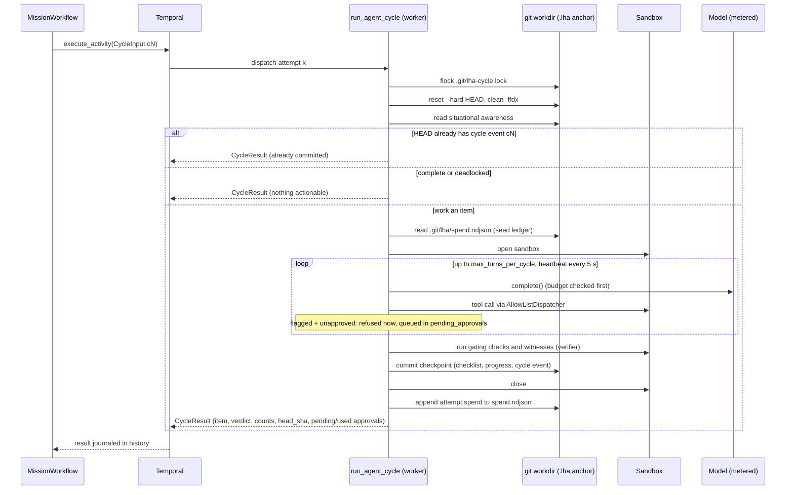
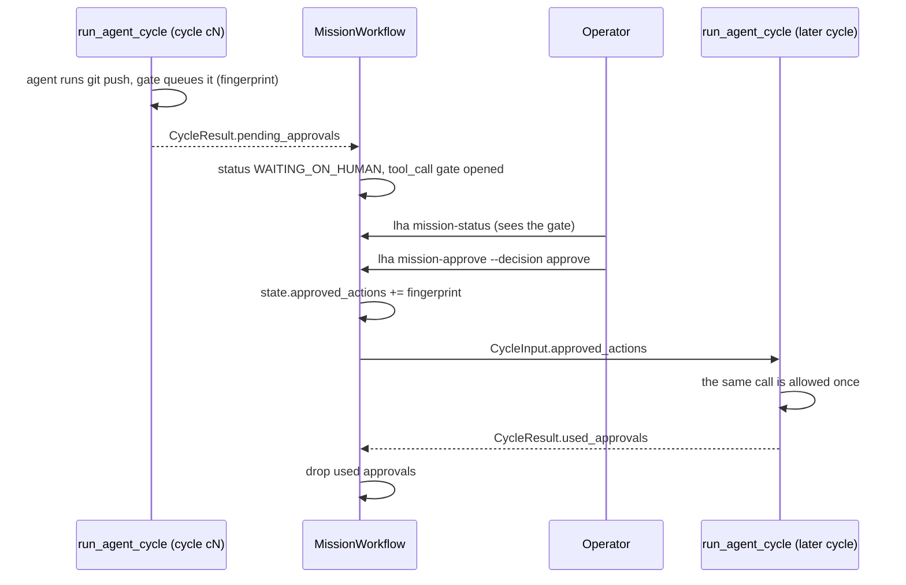

# Durable execution

The durable path runs a mission as a Temporal workflow. The workflow body is a deterministic
scheduler. The real work (model calls, tool calls in the sandbox, verification, git commits)
happens inside activities. Code: [`python/src/lha/durable/`](../python/src/lha/durable/).

The Go port does not have a Temporal layer yet. Use the Python worker for everything on this
page.

## Components

| Piece | File | Role |
|---|---|---|
| `MissionWorkflow` | [workflows.py](../python/src/lha/durable/workflows.py) | One long-lived workflow per mission (id `mission:<mission_id>`) |
| `SubAgentWorkflow` | [subagent_workflow.py](../python/src/lha/durable/subagent_workflow.py) | Child workflow that runs one sub-agent activity |
| Activities | [activities.py](../python/src/lha/durable/activities.py), [agent_activities.py](../python/src/lha/durable/agent_activities.py) | Non-deterministic work |
| Types | [types.py](../python/src/lha/durable/types.py) | Plain dataclasses that cross the Temporal boundary |
| Names | [signals.py](../python/src/lha/durable/signals.py) | Versioned signal and query names, status constants |
| Worker | [worker.py](../python/src/lha/durable/worker.py) | `lha worker` / `python -m lha.durable.worker` |
| Codec | [codec.py](../python/src/lha/durable/codec.py), [data_converter.py](../python/src/lha/durable/data_converter.py) | ClaimCheck payload offload |

The worker registers both workflows and these activities (Temporal activity type = function name):

| Activity | Called by | Timeout / retry | What it does |
|---|---|---|---|
| `run_agent_cycle` | `MissionWorkflow`, every cycle | start-to-close 1 h, heartbeat 2 min, retry policy below | Advances the mission by one checklist item |
| `check_mission_health` | `MissionWorkflow`, while parked | start-to-close 2 min, 1 attempt | Probes git, model config and sandbox |
| `unblock_items` | `MissionWorkflow`, after a human "retry" | start-to-close 5 min, 3 attempts | Resets every `blocked` item to `todo` and commits |
| `notify_gate` | `MissionWorkflow`, on every gate event | start-to-close 3 min, 3 attempts | Commits a `gate_<event>` event to the anchor and POSTs it to the optional webhook |
| `declare_impossible` | `MissionWorkflow`, after an "impossible" decision | start-to-close 5 min, 3 attempts | Final checkpoint: `mission_impossible` event, progress entry, commit `lha: mission declared impossible` |
| `read_mission_snapshot` | `MissionWorkflow`, terminal path | start-to-close 2 min, 3 attempts | Reads checklist counts and HEAD when no cycle has reported yet |
| `run_subagent` | `SubAgentWorkflow` | start-to-close 15 min, heartbeat 2 min, 3 attempts | Runs one role as a `SubAgent` |

Workflow `run` methods take exactly one argument. Temporal only applies type hints when the payload
count matches the parameter count, so the state carried across Continue-As-New rides inside
`MissionInput.state` rather than as a second parameter.

## The cycle activity

`run_agent_cycle` retry policy: initial interval 1 s, backoff 2.0, maximum interval 30 s,
maximum 5 attempts. `BudgetExceeded` and `MissionConfigError` are non-retryable. A
`.lha/decisions.ndjson` that fails hash-chain verification (`DecisionChainError`) is raised as a
non-retryable `MissionConfigError` (`decision log failed verification: ...`): retrying cannot fix
an altered log, so the mission fails instead of retrying and parking.

Temporal journals an activity's result, not the work inside it. A completed cycle is never re-run
on replay. An attempt that crashed is retried from scratch, and its model calls are paid for
again. Each attempt is made safe to repeat:

- **Workdir lock.** An exclusive `flock` on `.git/lha-cycle.lock`. A second attempt (for example a
  zombie attempt after a heartbeat timeout, and its retry) waits up to 300 s, heartbeating while it
  waits, then fails with the retryable `WorkdirBusyError`.
- **Clean start.** Each attempt runs `git reset --hard` and `git clean -ffdx` to HEAD first, so
  partial edits from a crashed attempt are discarded, not committed.
- **Exactly-once commit per cycle id.** Cycle ids are `c<n>`, derived from `cycles_done`. If one of
  the last 64 events in `HEAD:.lha/events.ndjson` is a `cycle` event with this id, the previous
  attempt committed and then crashed before reporting. The attempt returns that result instead of
  working another item.
- **Heartbeats.** Sent every 5 s while the agent loop runs, so a dead worker is detected after the
  2-minute heartbeat timeout rather than the 1-hour start-to-close timeout.
- **Spend journal.** Each attempt appends its spend to `.git/lha/spend.ndjson`. This file is outside
  the worktree, so the reset does not remove it. The next attempt's ledger starts from that
  total. See [Cost and budget](10-cost-and-budget.md).

The lead is assembled by [`agent/assembly.py`](../python/src/lha/agent/assembly.py), the same
code the local runners use. Model, sandbox kind and image, sandbox egress, the web allow-list and web settings,
trusted checks, protected harness paths, replanning limits and budget ceiling come from the
worker's settings (`get_settings()` is cached per process), except `check_commands` and
`budget_usd`, which come from `MissionInput`. A missing API key, a refused sandbox or malformed
`LHA_TRUSTED_CHECKS` raises a non-retryable `MissionConfigError`. Trusted checks run on the
worker host.

The activity also opens the mission store (SQLite, or Postgres when `LHA_POSTGRES_DSN` is set; see
[Configuration](18-configuration.md)) and the tiered memory service. Every metered call of the
attempt is written to the cost ledger under the key prefix `<cycle id>@<attempt>`, and the mission
row's status is set from the committed checklist after the cycle: `DONE`, `WAITING_ON_HUMAN` (the
cycle queued an approval), `IMPOSSIBLE` (deadlocked) or `RUNNING`, and `ABORTED` when the budget
is exhausted. The workflow itself never touches a database: the statuses only it knows reach
the row through the `record_mission_status` activity, which opens the store the same way and
upserts the row (idempotent): `SLEEPING`, `DEGRADED_PARK`, `WAITING_ON_HUMAN` when a gate opens,
and the final status of every ending, including a gate decision, `max_cycles`, a non-retryable
failure and a cancellation (written from a handler that runs after the cancel). It is best
effort: 30 s per attempt, three attempts within two minutes, then the workflow logs a warning and
goes on. An unusable Postgres store falls back to SQLite with a warning; with
`LHA_POSTGRES_FALLBACK_TO_SQLITE=false` it is a non-retryable `MissionConfigError` instead.



## Workflow loop and outcomes

Each iteration: stop at `max_cycles`, otherwise sleep while `resume_at` is in the future
([SLEEPING](#sleeping)), run one cycle, absorb its result (`head_sha`,
`items_done`, `items_total`, `last_item`), and ask a human about any irreversible actions it
queued ([human gates](#human-gates)). The mission ends with an explicit outcome:

| Outcome | Trigger | Final status |
|---|---|---|
| `completed` | `is_complete`: every checklist item verified done (or split into children that are) | `DONE` |
| `deadlocked` | `is_deadlocked`: items remain, none actionable, and no deadlock gate (or "retry" unblocked nothing) | `IMPOSSIBLE` |
| `impossible` | the deadlock gate's decision (human or default) was `impossible` | `IMPOSSIBLE` |
| `aborted` | the deadlock gate's decision (human or default) was `abort` | `ABORTED` |
| `budget_exhausted` | the cycle activity raised `BudgetExceeded` | `ABORTED` |
| `max_cycles` | `cycles_done >= max_cycles` | `ABORTED` |

Any other non-retryable activity error (for example `MissionConfigError`) fails the workflow with
an `ApplicationError`. `MissionInput` is validated first: an explicitly empty `check_commands`,
`cycles_before_can < 1` or `max_cycles < 0` fail the workflow before any cycle runs.

## Parking on degraded dependencies

When `run_agent_cycle` exhausts its retries on a retryable error, the workflow parks instead of
failing. It sets status `DEGRADED_PARK` and increments `parks`. Then it repeats: durable
`workflow.sleep(delay)`, then `check_mission_health`, until the probe reports healthy. The delay
starts at `park_initial_seconds` (default 60), doubles after each unhealthy probe, and is capped at
`park_max_seconds` (default 3600). Then status returns to `RUNNING` and the same cycle id is
retried.

The probe ([`probe_health`](../python/src/lha/durable/activities.py)) checks three dependencies
and passes them to `decide_safe_park` ([ops/degradation.py](../python/src/lha/ops/degradation.py)),
which parks only if a critical dependency (`git`, `model`, `sandbox`) is `DOWN`:

- `git`: the workdir is a repository with at least one commit.
- `model`: `probe_model` ([model/health.py](../python/src/lha/model/health.py)) builds the
  provider (primary and fallbacks) and contacts it with the cheapest request the backend offers,
  bounded by `LHA_MODEL_PROBE_TIMEOUT_S` (default 10 s), without spending tokens: Ollama
  `GET /api/tags` (the model must be pulled), OpenAI-compatible `GET /models`, Claude
  `GET /v1/models/<model>`; the stub is always healthy, and a fallback chain is healthy if any
  member is. A transport error, a timeout or a non-2xx answer (including 401/403) is `DOWN`, so the
  mission stays parked.
- `sandbox`: a sandbox session opens and closes.

## Human gates

The workflow opens a human gate in two places: for an irreversible tool call a cycle queued, and
(when `deadlock_gate_seconds > 0`) for a deadlock. While a gate is open:

- status is `WAITING_ON_HUMAN`; the previous status is restored when the gate closes;
- no cycle runs: the gate is awaited in the workflow loop before the next cycle starts;
- the `gate_v1` query returns a `GateView`: gate id, kind (`tool_call` or `deadlock`), question,
  options, default, opened / deadline times, reminders sent, the next reminder time, a
  recommendation, and the pending action (for a tool call). The `open_question` query returns the
  question followed by the options as one string, for example
  `... Approve or reject? [approve / reject]`. `lha mission-status` prints the `GateView`
  (it falls back to `open_question`, printed as `waiting on: ...`, for workers that do not answer
  `gate_v1`);
- the wait is a durable timer, so it survives worker restarts. On timeout the default is applied.

Decisions arrive on the `human_decision_v1` signal as a string. A decision is held until a gate
consumes it, so a decision sent before the gate opened is honoured, and it survives
Continue-As-New. Matching is case-insensitive; a decision that is not one of the open gate's
options is recorded in `rejected_decisions` and the gate keeps waiting. `lha mission-approve`
requires `--decision` (`approve` / `reject` for a tool-call gate, `retry` / `abort` /
`impossible` for a deadlock gate) and checks it against the open gate's options before sending
the signal. With no gate open it accepts any of the five words and the workflow holds it for the
next gate.

### Irreversible tool calls

The durable cycle gives the dispatcher a `DeferredApprovalGate`
([hitl/approvals.py](../python/src/lha/hitl/approvals.py)). An activity must not block for hours
on a person:

1. When the agent runs a command the classifier flags as irreversible (for example `git push`)
   and it has no approval, the gate refuses it for now. The model is told the action is queued
   for a human, not done, and to carry on with other work. The request is identified by a
   fingerprint and returned in `CycleResult.pending_approvals`. The dispatcher records the answer
   as a `tool_approval` event in the cycle's checkpoint.
2. After the cycle, the workflow opens a `tool_call` gate for each new fingerprint, one at a time
   (id `approval-<first 12 characters of the fingerprint>`): options `approve` / `reject`, default
   **`reject`**, timeout `MissionInput.approval_timeout_seconds` (default 86400;
   `lha mission-start --approval-timeout-hours`, default `LHA_APPROVAL_TIMEOUT_S`, 24 h).
3. **approve**: the action is added to `MissionState.approved_actions` and passed to every
   following cycle in `CycleInput.approved_actions`; the cycle prompt lists it as approved. The
   cycle's gate allows that exact fingerprint once; the cycle reports it in `used_approvals` and
   the workflow drops it. **reject** (by a human or the timeout): the fingerprint goes to
   `MissionState.rejected_actions`, the workflow never asks about it again, and the agent is still
   denied if it retries the call.



The fingerprint is the first 32 hex characters of the SHA-256 of the tool name and its exact
arguments as canonical JSON. Approving `git push origin main` does not approve `git push --force`
or a push to another remote.

Local runs have no workflow to park. `--approve-interactive` gives the dispatcher a
`TerminalApprover` (`console_gate()`): it prints the exact argv and the classifier's reason and
asks `Allow this exact call? [y/N]`. Anything but `y` / `yes` rejects; stdin that is not a TTY
rejects without asking; no answer within `LHA_CONSOLE_APPROVAL_TIMEOUT_S` (default 3600) rejects,
after a reminder at each `LHA_GATE_ESCALATION_SECONDS` offset inside that timeout. Without the
flag, irreversible commands are denied.

### Escalation ladder

Every gate (tool call and deadlock) is run by `_run_gate`
([workflows.py](../python/src/lha/durable/workflows.py)) with the pure helpers in
[hitl/escalation.py](../python/src/lha/hitl/escalation.py):

1. The gate opens: a `gate_log` line and a `notify_gate` activity (`opened`).
2. At each offset in `MissionInput.gate_escalation_seconds` (default
   `[900, 2700, 14400, 43200]`, from `LHA_GATE_ESCALATION_SECONDS`) that falls strictly inside the
   gate's timeout, with no valid decision yet: `escalations` is incremented and a `reminder`
   notification (step 1, 2, ...) is sent. Offsets at or past the timeout are ignored.
3. At the timeout: a `defaulted` notification and the default action.
4. A valid decision at any point: a `resolved` notification and that decision.

Waiting is `workflow.wait_condition` with a timeout per rung. `notify_gate` commits each event to
the anchor as `gate_opened` / `gate_reminder` / `gate_resolved` / `gate_defaulted` (commit
`lha: gate <event> (<kind> <gate id>)`, secrets in the question and arguments redacted) and POSTs
the same JSON to `LHA_GATE_WEBHOOK_URL` when the worker has it set (off by default; timeout
`LHA_GATE_WEBHOOK_TIMEOUT_SECONDS`, default 5 s). The webhook is sent from the activity, never
from workflow code. A notification problem never fails the gate or changes its decision: the
activity reports `recorded` / `webhook` outcomes instead of raising, and an activity error only
adds a `gate_log` line.

### Deadlock gate

A deadlock is "not complete, but nothing actionable". This happens when items are `blocked` after
repeated verification failures (and the replanner did not split them), or when dependencies can
never be satisfied. If `MissionInput.deadlock_gate_seconds` is 0 (the dataclass default), the
mission ends immediately as `deadlocked`. `lha mission-start` sets it from
`--deadlock-gate-hours` (default 24; `0` turns the gate off). Otherwise the workflow opens a
`deadlock` gate (id `deadlock-<cycles_done>`):

- options `retry` / `abort` / `impossible`;
- default `MissionInput.deadlock_gate_default`: `abort` (default) or `impossible`
  (`mission-start --deadlock-default`, else `LHA_DEADLOCK_GATE_DEFAULT`). Any other value falls
  back to `abort`; `retry` is never an unattended default;
- the workflow counts consecutive non-passing cycles on the same item (`fail_item`,
  `fail_streak`). When `ops.lifecycle.should_declare_impossible(consecutive_failures=fail_streak,
  threshold=impossible_after_failures)` is true (default threshold 3,
  `LHA_IMPOSSIBLE_AFTER_FAILURES`), the gate's `recommended` field is `impossible` and the
  question says why;
- **retry**: `unblock_items` (cycle id `u<n>`) resets every `blocked` item to `todo`; the mission
  continues if at least one item was unblocked, otherwise it ends `deadlocked`;
- **abort**: outcome `aborted`, status `ABORTED`;
- **impossible**: `declare_impossible` (cycle id `impossible-<cycles_done>`) writes the final
  checkpoint, then outcome `impossible`, status `IMPOSSIBLE`.

The result's `reason` says whether a human or the default decided.

## SLEEPING

`SLEEPING` is the status while the workflow waits on a durable timer by design, distinct from
`DEGRADED_PARK` (a dependency is down) and `WAITING_ON_HUMAN` (a gate is open). At the top of each
iteration, if `MissionState.resume_at` (epoch seconds) is in the future, the workflow sleeps until
then (`wait_condition` with a timeout, so a new `snooze_v1` moves or ends the sleep), then sets
`resume_at` back to 0 and status `RUNNING`. `resume_at` is set by:

- `MissionInput.resume_at`: a scheduled start (first run only; `mission-start --start-in-seconds`);
- `MissionInput.cycle_pause_seconds` > 0: after every cycle that did not end the mission, a pause
  before the next one (`--cycle-pause-seconds`, `LHA_CYCLE_PAUSE_SECONDS`);
- the `snooze_v1` signal (`lha mission-snooze`): `seconds` > 0 sleeps that long before the next
  cycle, `0` wakes the mission now.

The `resume_at` query returns the wake-up time (0 when not sleeping).

## Signals, queries and statuses

| Name (wire) | Kind | Payload / result |
|---|---|---|
| `human_decision_v1` | signal | decision string, held until a gate consumes it |
| `snooze_v1` | signal | seconds to sleep before the next cycle (`0` wakes) |
| `steer_v1` | signal | note appended to `steer_notes` (max 20 notes, 2000 chars each); every following cycle's prompt includes them |
| `status_v1` | query | current status string |
| `gate_v1` | query | the open `GateView`, or `null` |
| `gate_log_v1` | query | recent gate and sleep events (last 50 lines) |
| `open_question` | query | the open gate's question and options (`""` if none) |
| `cycles_done` | query | completed cycle count |
| `last_item` | query | id of the last worked item |
| `resume_at` | query | epoch time the mission sleeps until (0 if not sleeping) |
| `park_reason` | query | why the mission is parked (`""` if not) |
| `rejected_decisions` | query | decisions discarded by a gate |

`signals.py` also defines `UPDATE_VERIFY_VERDICT = "verify_verdict_v1"`. No workflow registers
an update handler for it. The statuses are `RUNNING`, `SLEEPING`, `DEGRADED_PARK`,
`WAITING_ON_HUMAN`, `DONE`, `IMPOSSIBLE` and `ABORTED`. The CLI covers `mission-status`
(status, cycles, open gate, sleep, recent gate events), `mission-approve` (`human_decision_v1`,
validated against the open gate first), `mission-snooze` (`snooze_v1`) and `mission-abort`
(workflow cancellation). There is no CLI command for `steer_v1`.

## Continue-As-New

The workflow continues as new every `cycles_before_can` cycles (default 200). It also does so
whenever Temporal reports `is_continue_as_new_suggested()`, including between park probes. The
new run receives the same `MissionInput` with `state` set to the current `MissionState`:
`cycles_done`, `status`, `head_sha`, `items_done`, `items_total`, `last_item`,
`pending_decision`, `steer_notes`, `parks`, `deadlock_retries`, `approved_actions`,
`rejected_actions`, `fail_item`, `fail_streak`, `resume_at`, `escalations` and `gate_log` (last 50
lines). Nothing else is carried: no history and no transcripts. `rejected_decisions`,
`park_reason`, `open_question` and the open gate view are instance fields and reset in the new run
(a gate is never open across a Continue-As-New). A run that continued as new during a park starts
with a cycle attempt, not another sleep.

## Idempotency

- Workflow id is `mission:<mission_id>`. `start_mission()` in `worker.py` relies on Temporal
  rejecting a duplicate id. `lha mission-start` mints a new mission id on every invocation, so
  running it twice starts two missions.
- Cycle commits are exactly-once per cycle id (see above).
- Spend journal rows are keyed by `idempotency_key(mission_id, cycle_id, attempt)`. Readers keep
  the last row per key and skip a torn final line.
- Sub-agent child ids are `subagent:<mission>:<role>:<workflow.uuid4()[:12]>`. They are
  deterministic under replay and unique across fan-outs.

## Sub-agent fan-out

`research_children()` starts one `SubAgentWorkflow` per input concurrently. It returns every
output and every failure (as `role: ExceptionType: message`), and re-raises cancellation.
`run_subagent` builds its own `CostMeter` from the worker's `budget_usd_ceiling`. That meter is not
seeded from the mission's spend journal. `MissionWorkflow` does not call `research_children` today.
The fan-out is implemented and tested
([test_subagent_fanout.py](../python/tests/durability/test_subagent_fanout.py)) but not part of
the mission loop.

## ClaimCheck payload codec

`ClaimCheckCodec` replaces any payload larger than 32 KiB with a pointer. The pointer has encoding
`lha/claimcheck/v2` and its data is the object key. The codec stores the whole serialized
`Payload` (data and all metadata), so decoding restores it byte for byte. v1 pointers
(`lha/claimcheck`) still decode. `build_data_converter()` installs the codec. The client
(`connect_client`), every worker and the replayer must use the same converter and the same
object store root (`LHA_OBJECT_STORE_ROOT`, default `.lha/objects`).

The only store is `LocalFileObjectStore`
([object_store.py](../python/src/lha/persistence/object_store.py)):

- the key is the SHA-256 of the blob, validated as 64 lowercase hex characters before it touches
  the filesystem;
- the root is resolved to an absolute path at construction;
- writes are atomic (temp file, `fsync`, `os.replace`);
- reads re-hash the blob and raise `ObjectCorruptError` on a mismatch.

Blobs are stored in plaintext. The module docstring mentions an S3 adapter, but none exists.
Workers on different hosts need a shared filesystem at the store root.

## Replay safety net

[`replay_test_harness.py`](../python/src/lha/durable/replay_test_harness.py) replays every
`*.json` history in a directory against the current `MissionWorkflow` and `SubAgentWorkflow`
code, using the worker's data converter. [`test_replay.py`](../python/tests/durability/test_replay.py)
has these tests:

- `test_fresh_history_replays` / `test_fresh_approval_ladder_history_replays`: record a
  three-item mission, and a two-item mission whose queued `git push` is approved at a gate on the
  escalation ladder, on the time-skipping test server and replay them;
- `test_recorded_histories_still_replay`: replays every committed history in
  [`histories/`](../python/tests/durability/histories/): `mission_three_items.json`,
  `mission_deadlock_gate_legacy.json` and `mission_approval_gate_legacy.json` (a deadlock gate
  answered "retry" and an approval gate answered "approve", recorded with the workflow code from
  before the escalation ladder), `mission_approval_ladder.json` and `mission_row_gate_retry.json`
  (a deadlock gate answered "retry", then done, with the workflow's mission-row writes);
- `test_committed_histories_cover_what_they_claim`: the legacy histories carry no patch marker, the
  ladder history carries `lha-gate-escalation-v1` and its `notify_gate` activities, only the
  mission-row history carries `lha-mission-row-v1` and schedules `record_mission_status`;
- `test_replay_detects_a_changed_workflow`: renames `run_agent_cycle` in a copy of the history and
  expects a non-determinism error.

Behaviour added to `MissionWorkflow` after histories were recorded is guarded by
`workflow.patched(...)`, so an older history replays down the old code path:

| Patch id | Guards |
|---|---|
| `lha-gate-escalation-v1` | gates with the escalation ladder and `notify_gate`, and the deadlock gate's `impossible` option (the older `await_human_gate`, with `approve`/`reject` or `retry`/`abort`, is kept for replay) |
| `lha-sleeping-v1` | the `SLEEPING` durable timer (scheduled start, pause between cycles, snooze) |
| `lha-mission-row-v1` | the `record_mission_status` activity: the workflow writes `SLEEPING`, `DEGRADED_PARK`, an open gate's `WAITING_ON_HUMAN` and every final status to the mission row |

Without the `lha-gate-escalation-v1` guard both legacy histories fail replay with a
non-determinism error (`notify_gate` issued where `run_agent_cycle` / `unblock_items` was
recorded). CI runs these tests with `tests/durability`. If a workflow change is intentionally
incompatible and ships behind a new worker build, re-record ONE history from `python/` and keep
the older ones replaying:

```bash
LHA_RECORD_HISTORY=1 uv run pytest tests/durability/test_replay.py -k test_fresh_history_replays
```

Recording rewrites machine-specific paths in payloads (the workdir becomes `/workspace/mission`,
the interpreter becomes `python3`) so the committed history is portable. The code does not
configure worker versioning or Build IDs. Pinning builds is an operational step outside the
repository. See [Running on Temporal](14-running-on-temporal.md) and the
[operations runbook](15-operations-runbook.md).
