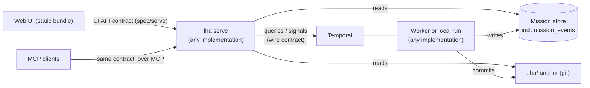

# Mission UI: design

Status: design. Phase 0 is in progress; nothing below is built yet unless marked done. This page is
the plan for watching and steering missions from a browser and from MCP clients, and the contracts
that keep that UI independent of which LHA implementation runs a mission.

## Why

Watching the multi-day fabric-emulator mission (October 2026) took `git log`, the anchor's
`checklist.json`, SQL on the cost ledger, `temporal workflow describe`, `docker ps` and `pgrep`, and
still could not answer the main question: what the agent was doing during a 45-minute cycle. Three
gaps sat underneath any UI (Phase 0 below closed them):

- A durable cycle records no tool calls. The cycle activity runs without a trace recorder, so the
  worker log had nothing and the cycle event only counted them (70).
- A `claude_code` session is opaque until it ends: no turns, tools or spend while it runs.
- A session killed at its timeout reports no cost, so it is charged its whole cap (the first cycle
  was charged $5.00 with no tokens recorded).

Temporal's UI answers infrastructure questions (is the workflow running, parked or retrying;
activity attempts and heartbeats; history and signals). It does not know what an item, a witness, a
diff, spend against the ceiling or a gate's question is, and local runs (`run-local`, `mission`,
`orchestrate`) never touch Temporal. It stays the drill-down for infrastructure, linked from the UI.

## Principle: the UI depends on contracts, not on an implementation

LHA has a Python implementation and a Go port, and may get a Rust one. The UI must work the same
whichever runs a mission, so it depends only on contracts in [`spec/`](../spec/), never on an
implementation's code:

- **The UI** is a static bundle that speaks one JSON and Server-Sent Events API, defined in
  `spec/serve/` with fixtures every server is tested against.
- **Every implementation ships `lha serve`** and passes the same conformance tests, as it does for
  every other command. None is privileged; the UI cannot tell them apart.
- **Any server watches any worker's missions.** `lha serve` reads only shared contracts: the store
  schema (`db/migrations`), the `.lha/` anchor format, the Temporal queries in the
  [wire contract](19-wire-contract.md), and the new `mission_events` table below. A Python
  `lha serve` shows a mission a Go worker runs, and the reverse.
- **Controls are existing contracts too.** Steer, snooze, checklist edits and gate answers are the
  wire contract's signals (`steer_v1`, `snooze_v1`, `checklist_edit_v1`, and `human_decision_v2`,
  which carries who answered), and abort is a workflow cancellation, as `lha mission-abort` does.
  Every implementation's worker obeys them. Local runs have no control channel, so the UI is
  read-only for them.

## Contract coverage

The UI and every implementation meet only at contracts, so the contracts are complete, current and
fully tested, in CI, for every implementation. Contract tests are fast, so 100% is the bar, not a
target.

Enforced today, for the behavioural cases in [`spec/`](../spec/README.md):

- **Every file and every case group is checked by every implementation.** Go's
  `go/internal/spec` records which files and top-level groups its tests read and fails a full run
  on any gap; it decodes each group strictly, so a nested field a test does not map fails too.
  Python's runner does the same under `pytest --contract-coverage`, which CI passes. A Rust
  implementation adds its runner under the same rule.
- **The cases cannot fall behind the code.** CI regenerates every file from the Python reference
  and fails on any difference.
- **Every file is indexed** in `spec/README.md` (a unit test).
- **Every recorded event matches its kind's schema** in `spec/obs/mission_events.json`. With
  `LHA_TRACE_AUDIT_DIR` set, every trace recorder also appends the events it records to a file
  there; CI runs each implementation's suite that way and fails on an unknown kind, a payload that
  breaks its schema, or a kind no test recorded. The schemas are the event types the UI API sends.

For the UI API (Phase 1), contract first:

- `spec/serve/openapi.json` (OpenAPI 3.1, JSON so every implementation reads it with its
  standard library) is written before any server code, and is the only definition of the API.
  Its `MissionEvent` payloads `$ref` the per-kind schemas in `spec/obs/mission_events.json`.
  Done.
- One black-box runner (`python/tests/serve`) exercises any implementation's `lha serve` over
  HTTP: the cases in `spec/serve/cases.json` against the store and anchors in
  `spec/serve/fixture.json`, with every response validated against the OpenAPI schemas. CI runs
  it against the Python and the Go server, with Temporal unreachable and with a fake mission
  workflow. Done.
- CI fails unless every operation, every documented status code and every event kind has a case,
  and unless every route a server registers is in the spec (no undocumented endpoints). Done.
- The spec is linted (Redocly) in CI, and a breaking change against the previous commit (or a pull
  request's base) fails CI unless the API's major version changes (`spec/serve/check-breaking.sh`,
  oasdiff). Done. The UI's TypeScript types are generated from the spec with a drift check
  (Phase 2, with the UI).

## Phase 0: `mission_events`, the shared event record

One new table, written by every run path of every implementation, so a reader never needs logs:

| Column | Type | Meaning |
|---|---|---|
| `id` | integer, increasing | the cursor a reader resumes from (`?since=`, SSE `Last-Event-ID`) |
| `mission_id` | text | |
| `cycle_id` | text | `""` outside a cycle |
| `ts` | text | ISO-8601 UTC |
| `kind` | text | the event kind (below) |
| `payload` | JSON text | redacted like every trace event |
| `schema_version` | integer | `1` |

The rows are the trace events LHA already emits ([observability](16-observability.md): `tool_call`
with its error tail, `llm_turn`, `turns_exhausted`, `checkpoint`, `claude_code_session`, `code_map`,
`system_one`, ...), persisted instead of only logged, plus two new kinds:

- `verify`: a verification ran (inside a cycle or from a session's `verify` tool): verdict and each
  check's name, pass, exit code and duration.
- `session_progress`: a `claude_code` session's progress while it runs, from
  `claude -p --output-format stream-json`: turn number, the tool it called, and its spend so far.

Work items:

1. Spec the table, the kinds and their payload fields, add the migration (Postgres and SQLite),
   and a store method to append and to read `since` an id. Done: every kind's payload is a JSON
   Schema in [`spec/obs/mission_events.json`](../spec/obs/mission_events.json), which both test
   suites enforce (see [Contract coverage](#contract-coverage)).
2. Persist trace events on every run path, including the durable cycle activity, which had no
   recorder, and the organization's sub-agents (their `tool_call` events carry `role`). Writes are
   best effort: a store outage never fails a cycle. Done.
3. Record `verify` events: what asked for the run (`done`, the session's `verify` tool, or the end
   of the cycle), the verdict and each check. Done.
4. Stream a `claude_code` session (`stream-json`): `session_progress` events while it runs, and a
   killed session charged the spend it streamed instead of its whole cap. Done.

Python first, then Go, with spec cases for both. Phase 0 is useful without any UI: `lha
mission-report` and plain SQL can read it.

## Phase 1: `lha serve`, the UI API

Status: both implementations serve the contract below and pass every case. Item detail (attempts,
witnesses, diffs) and per-role cost breakdowns are additive operations still to come.

- Reads: `GET /api/v1/health`; `/api/v1/missions` (each with its spend, item counts and last
  event); `/missions/{id}` (plus its description, workdir, and for a running durable mission its
  workflow's live state: status, cycles, open gate, open question, wake time, steering notes,
  pending edits); `/missions/{id}/items` (the anchor's checklist); `/missions/{id}/events?after=`
  (recorded events, paged forward by id); `/missions/{id}/costs`; `/missions/{id}/gates`.
- Live: `GET /api/v1/stream` (Server-Sent Events, resumable with `Last-Event-ID`): `mission_event`
  messages, and a `mission` message when a mission's row changes.
- Controls (durable missions): `POST` `steer`, `snooze`, `checklist-edits`, `decision` (with the
  person's name, sent as `human_decision_v2`) and `abort` (a workflow cancellation). A local run is
  `409 not_durable`, a finished mission `409 finished`, Temporal unreachable `503`.
- Still to come, as additive operations: item detail (attempts, witnesses with their latest
  results, diffs including failed attempts under `refs/lha/attempts/`) and costs by role.
- Contract: [`spec/serve/`](../spec/serve/README.md); every implementation's server is tested
  against it.

Performance rules, because the cost is in how the server gets its data, not in the framework:

- One shared reader per server follows `mission_events` by cursor and the mission rows, and fans
  out to every client; no per-client polling of the store or of git.
- Temporal status is fetched at most every few seconds per mission and shared, never per request
  (a query can make the worker replay the workflow).
- Commits and diffs are cached by commit hash; git never runs per request.

## Phase 2: the web UI

Status: built ([`ui/`](../ui/README.md)), served by both implementations at the start-up URL:
the missions list, and per mission its live state, open-gate banner (answered with a name),
steering, snooze and abort, the checklist, the live timeline, gates and spend. About 15 KB of
gzipped JavaScript. Still to come: dependency view, per-item attempts and diffs, spend charts.

Pages: missions (status, items done out of total, spend against the ceiling, last activity, parked
or waiting badges); one mission (checklist with dependencies, attempts and status, live timeline,
gates, spend rate and an estimated finish, a link into Temporal's UI); one item (description,
witnesses and their latest results, each attempt's failure report and diff, commits); costs by
cycle and role.

Stack: Vite, TypeScript and Preact (`preact-iso` routing), the browser's `EventSource`, uPlot for
charts, plain CSS with light and dark themes. Built once from `ui/` into a static bundle that every
implementation's package embeds (committed, with a CI check that a rebuild matches, as for
`spec/`); budget under 150 KB compressed. The timeline renders a window of rows, events are applied
once per animation frame, and diffs load when opened.

Security: binds to `127.0.0.1` and checks the `Host` header (DNS rebinding); a random token in the
start-up URL becomes a `SameSite=Strict` cookie; every write also needs an `X-LHA-Token` header; no
CORS; a gate answer requires a name, recorded on the gate row.

## Phase 3: MCP

The same server answers MCP at `/mcp`, and `lha mcp --stdio` serves desktop clients. Tools: list
missions, status, report, item detail, timeline, costs, steer and snooze. **No gate answers and no
abort over MCP**, pinned by a test: an agent must not be able to approve its own irreversible
actions, which is what the human gate exists to prevent.

## Phase 4 (optional): `lha watch`

A refreshing terminal view of one mission for SSH sessions, reading the same API, no new dependency.

## Measured basis

A minimal server with a JSON endpoint and an event stream fanned out to many clients, on a Mac
(3 October 2026; synthetic, so approximate):

| | Go `net/http` | Python Starlette + uvicorn |
|---|---|---|
| memory, idle | 10 MB | 21–26 MB (45 MB before macOS reclaimed pages) |
| 10 clients at 10 events/s | 11 MB, 0.3% of a core | 21 MB, 0.4% |
| 200 clients at 10 events/s | 20 MB, 3.5% of a core | 26 MB, 3.3% |
| JSON, 20 connections | 44,000 requests/s | 8,500 requests/s |

At a UI's scale (a few tabs, a few events a second) both stay well under 1% of a core and 10–25 MB,
so the server's language is a packaging choice, not a requirement; the browser tab (30–80 MB) is the
largest cost.
